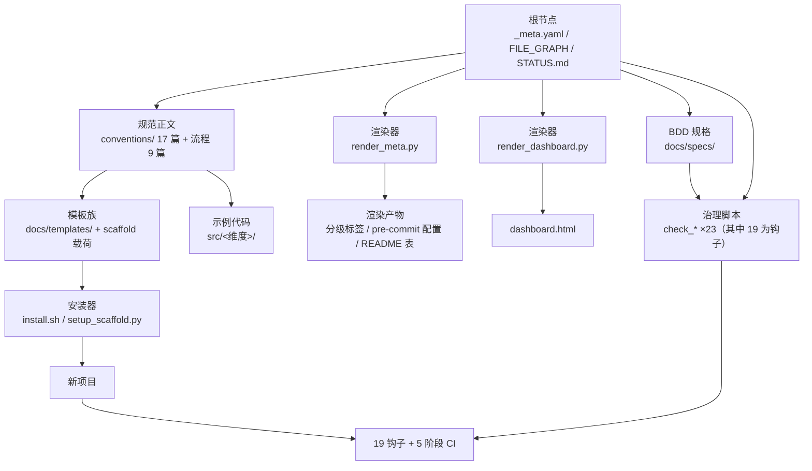

# devguard 架构总览

> 更新: 2026-08-13
> 本文档是 devguard **当前架构**的持续维护说明（组件清单 + 依赖方向 + 数据流 + 关键机制）。
> 定位：`docs/plan/项目介绍-PRD.md` 的组件级展开；流程类细节引用 PRD §三，本文档不重复。
> 维护纪律：任何架构变更（新增组件 / 改变依赖方向 / 新增机制）必须回写本文档，与实现同 PR。

## 一、组件清单

| 组件 | 位置 | 职责 | 上游依赖 |
|------|------|------|---------|
| 规范正文 | `conventions/01-06,08` + `ai-workflow_AI协作开发流程/`（9 篇） | 定义"该怎么做"（17 维度 + 双轨流程） | —（根） |
| 规范元数据真源 | `conventions/_meta.yaml` | 分级/工具链版本/路由/L1 检测的唯一真源 | —（根） |
| BDD 规格 | `docs/specs/00-10` | 规范 ↔ 验收互检 | 规范正文 |
| 模板族 | `docs/templates/` | 权威模板 + scaffold 载荷（core/optional manifest） | 规范正文 |
| 渲染器 | `scripts/render_meta.py` / `render_dashboard.py` | 真源 → 渲染产物（分级标签/pre-commit 配置/README 表/dashboard） | _meta.yaml、STATUS.md |
| 安装器 | `scripts/install.sh` / `install.ps1` / `setup_scaffold.py` | 引导 + 事务化初始化新项目 | 模板族 |
| 治理脚本 | `scripts/check_*.py`（23 个） | 一致性/强制力/收束/豁免等闸门 | 真源 + 渲染产物 |
| 测试 | `tests/conventions/`（210 测试） | 治理脚本与契约的自动化证明 | 治理脚本 |
| 钩子配置 | `.pre-commit-config.yaml`（渲染产物） | 19 个 pre-commit/commit-msg 钩子 | render_meta |
| CI | `.github/workflows/ci.yml` | 5 阶段（lint/test/l4-conventions/compliance/build） | 治理脚本 |
| 示例代码 | `src/<维度>/` | 规范 §二落地配置的可运行版 | 规范正文 |
| 进度真源 | `STATUS.md` | 进度数据（dashboard 解析它） | 开发清单 |
| 文件归类权威 | `meta/FILE_GRAPH.md` | 新文件放哪的决策树 + 命名/权限/归档规约 | —（根） |
| 豁免账 | `meta/豁免清单.md` | [skip-*] 豁免登记（append-only） | 治理脚本 |
| 入口 | `CLAUDE.md`（AI）/ `README.md`（人）/ `AGENTS.md`（Codex） | 路由到规范与流程 | 全部 |

## 二、依赖方向



**规则**：依赖单向向下；真源（_meta.yaml / STATUS.md / FILE_GRAPH）不被任何下游写；渲染产物禁止手改（漂移即 CI fail）；`docs/templates/devguard/scripts/` 与 `scaffold/core/` 是 `scripts/` 与根配置的**镜像**（逐字节校验）。

## 三、数据流与真源

### 3.1 真源渲染流（_meta.yaml）

```
conventions/_meta.yaml（唯一手维护真源）
    │  render_meta.py
    ├──→ 各规范顶部「分级标签」小节
    ├──→ 根 .pre-commit-config.yaml
    ├──→ README.md 分级表
    └──→ CI 范围（l4-conventions 阶段读取）
    │
    └── 回环校验：render_meta.py --check（CI）+ check_consistency.py
```

### 3.2 进度渲染流（STATUS）

```
STATUS.md（进度真源）── render_dashboard.py ──→ dashboard.html（渲染产物，禁止手改）
```

### 3.3 模板镜像链（逐字节）

| 镜像对 | 校验方 |
|--------|--------|
| `scripts/*.py` ↔ `docs/templates/devguard/scripts/*.py` | check_template_drift（脚本镜像） |
| `requirements-dev.txt` ↔ `scaffold/core/requirements-dev.txt` | check_template_drift（SCAFFOLD_MIRRORS） |
| `conventions/_meta.yaml` ↔ `docs/templates/devguard/conventions/_meta.yaml` | 同上 |
| `.github/workflows/ci.yml` ↔ `docs/templates/devguard/.github/workflows/ci.yml` | 同上 |

## 四、关键机制

### 4.1 事务化初始化（setup_scaffold.py）

manifest 显式声明（core 必装 + optional 选装）→ 逐文件原子替换写入 → 任一步失败回滚已写文件 → 初始化后自检（devguard.py verify）→ 双阶段 hooks + 隔离 .venv。`--dry-run` 零写入预演、`--verify` 复验、`--require-hooks` 强制钩子在场。

### 4.2 真源渲染 + 漂移检测

`_meta.yaml` 是唯一手维护源头；渲染产物由 CI 的 `render_meta.py --check` 兜底；模板镜像链由 `check_template_drift.py` 逐字节校验（2026-08-13 扩展 scaffold 载荷镜像，故障注入验证）。

### 4.3 收束闸门（check_convergence_gate.py）

STATUS.md 的 `convergence-gate` 标记声明预设节点；开发清单中 ✅ 功能点编号越过未收束节点时拦截提交。豁免走 `[skip-gate]` + 豁免账登记。

### 4.4 豁免账（meta/豁免清单.md）

所有 `[skip-*]` 标记必须：§二 登记标记类型 + §三 追加使用记录（日期/范围/钩子/申请人/原因）；append-only；`check_exemption_log.py` 无豁免（账本读取失败 fail-closed）。

### 4.5 钩子链（19 + 10）

- **pre-commit 阶段（10）**：trailing-whitespace / end-of-file-fixer / check-yaml / check-json / check-added-large-files / ruff / ruff-format / gitleaks / markdownlint / ecc-alignment
- **commit-msg 阶段（9）**：commitlint / commit-msg-worklog-ref / commit-msg-status-updated / commit-msg-worklog-structure / commit-msg-file-placement / commit-msg-exemption-log / commit-msg-updated-tag / commit-msg-doc-sync / commit-msg-convergence-gate
- **CI 辅助（本地 commit-msg 内）**：check_claude / check_status / check_plan 结构同步（由 19 钩子框架托管）
- **CI（5 阶段）**：lint → test → l4-conventions → compliance → build

## 五、版本与一致性矩阵

| 检查 | 脚本 | 阈值 |
|------|------|------|
| 一致性事实矩阵 | check_consistency.py | ≥95% |
| 故障注入拦截率 | check_enforcement.py | ≥90% |
| ECC 十域对标 | check_ecc_alignment.py | ≥80% |
| 模板漂移（含 scaffold 镜像） | check_template_drift.py | 0 漂移 |
| 测试基线 | tests/conventions/ | 210/210 |

工具链真源：`_meta.yaml toolchain`（ruff 0.15.20 / gitleaks 8.24.3）；依赖钉版：`requirements-dev.txt`。

## 六、架构变更纪律（收口规则）

1. 任何架构变更 → 设计提案（docs/plan/design/ 五段式 + Owner 决策节）→ 实施 → **回写本文档**（组件清单/依赖图/机制章节），与实现同 PR。
2. 变更真源 → 同步镜像对（§三.3 表全部）。
3. 变更 FILE_GRAPH（文件放置）→ 同步本文档组件清单。
4. 违反纪律 → check_doc_sync / check_template_drift 拦截（自动）或红蓝对抗审查（人工）。
5. 对抗式验证（ADR 0009）：关键闸门的验证声称必须附可复现命令 + 真源侧反向变异（变异 `_meta.yaml` toolchain 字段须 rc=1），禁止仅变异下游引用。
