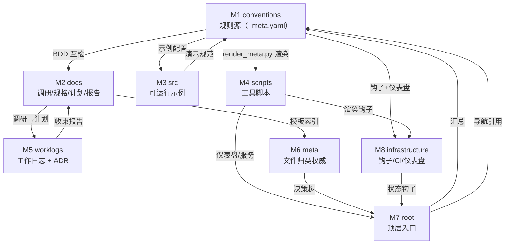

# devguard · 8 个模块设计文档总索引

> devguard 项目设计文档中枢 · 2026-06-10
> 配套说明：[README-设计文档说明.md](../README-设计文档说明.md)
> 更新: 2026-06-11

---

## 三句话读懂

1. 这是 devguard 项目的 **8 个模块** 设计文档总索引 —— 每个模块按 M1 参考模板（`M1-im-chat-v2.0-参考模板/`）产出 7 件文档。
2. 8 个模块对应项目顶层目录的核心分区（`conventions/` / `docs/` / `src/` / `scripts/` / `worklogs/` / `meta/` / 根入口 / `infrastructure/`），是把"目录索引"沉淀为"可深度阅读的设计资产"。
3. 用于 **新人理解项目结构、实施者定位落地配置、文件治理者追溯决策** —— 配合 `meta/FILE_GRAPH.md` 使用效果最佳。

---

## 8 个模块速览

| # | 模块 | 路径 | 三句话简介 | 状态 |
|---|------|------|-----------|------|
| **M1** | 规范正文 | [`M1-conventions-规范正文/`](M1-conventions-规范正文/README.md) | devguard 的**规则源** —— 17 篇规范正文 + 10 篇 AI 协作流程；`_meta.yaml` 经 `render_meta.py` 渲染出钩子/仪表盘/CI 范围 | 完成（v2.0） |
| **M2** | 文档资产 | [`M2-docs-文档资产/`](M2-docs-文档资产/README.md) | 沉淀调研 / 规格 / 计划 / 报告 四大类文档；模板权威来源在 `docs/templates/`，新增模板必走模板索引登记 | 完成 |
| **M3** | 示例代码 | `M3-src-示例代码/` | 按规范维度落地的**可运行配置集**（01-06 规范各配一份可执行示例）；规范改配置则同步本模块 | 产出中 |
| **M4** | 工具脚本 | `M4-scripts-工具脚本/` | `start_server.py` / 仪表盘生成器 / `render_meta.py` 等工程脚本的集合；M1 规范的渲染中枢 | 产出中 |
| **M5** | 工作日志 | [`M5-worklogs-工作日志/`](M5-worklogs-工作日志/README.md) | 日常工作的流水 + 收束节点的 ADR 存档（`decisions/0001-0006`）；每功能点必更新 worklog | 完成 |
| **M6** | 元信息 | `M6-meta-元信息/` | **文件归类权威** —— `FILE_GRAPH.md` 决策树决定"新文件放哪"；是 M1 之外的另一处真源 | 产出中 |
| **M7** | 顶层入口 | `M7-root-顶层入口/` | `CLAUDE.md`（AI 入口）+ `README.md`（人入口）+ `STATUS.md` + `dashboard.html`；新人第一站 | 产出中 |
| **M8** | 基础设施 | `M8-infrastructure-基础设施/` | 钩子配置（`.pre-commit-config.yaml`）+ 仪表盘渲染 + CI 范围；由 M1 + M4 共同驱动 | 产出中 |

---

## 阅读建议（按角色）

### 新人入门
1. 先读 **M7 root**（顶层入口）—— 看清 `CLAUDE.md` 的"目录索引"和"规范速查"表
2. 再读 **M1 conventions**（规则源）—— 理解整套规范的设计意图和真源策略
3. 按需展开 M2-M6 —— 调研走 M2，示例看 M3，脚本翻 M4，决策看 M5 的 ADR

### 实施者（要动代码/配置）
- 必读 **M4 scripts** + **M8 infrastructure**（落地配置的执行链路）
- 配合 **M2 docs** 的 `开发清单.md` + `STATUS.md` 看当前进度

### 文件治理者（要新增/移动文件）
- 起点是 **M6 meta** 的 `FILE_GRAPH.md` 决策树
- 操作后必须同步 `meta/FILE_GRAPH.md` + 本索引

---

## 8 模块依赖关系

**中枢节点**：`M1 conventions/_meta.yaml` —— 是真源，向外辐射到 M4（脚本渲染）、M8（钩子配置）、M7（dashboard 数据）三个方向。

---

## 文档约定（每个模块 7 件）

每个模块文件夹按 M1 参考模板产出以下 7 件文档：

| # | 文件 | 用途 |
|---|------|------|
| 1 | `README.md` | 模块门面：3 句话读懂 + 文档索引 + 快速预览 |
| 2 | `简报.md` | ≤80 行速读 + 关系拓扑 mermaid |
| 3 | `设计.md` | 设计意图 → 真源策略 → 边界/红线 |
| 4 | `实现计划.md` | 演进路径 + 阶段拆解 + 里程碑 |
| 5 | `阅读笔记.md` | 章节导航 + 概念索引 + 思考题 |
| 6 | `deliverable.md` | 交付物清单 + Owner 决策点 |
| 7 | `设计.html` + `实现计划.html` | 2 个 HTML 渲染占位（由 `scripts/` 渲染器产出） |

> 注：编号 7 实际是 2 个文件（设计.html + 实现计划.html），合计 **7 件**。

---

## 维护规则

| 触发场景 | 必须同步 |
|---------|---------|
| 新增模块（M9+） | 本索引速览表 + 依赖关系图 + 阅读建议 |
| 合并两个模块 | 速览表合并条目 + 删除依赖图中的孤立节点 |
| 拆分模块 | 速览表拆条 + 依赖图增加子节点 + 阅读建议更新 |
| 模块重命名 | 速览表路径列 + 依赖图节点 label + 文档约定不变 |
| 文档约定变更（如 7 件 → 6 件） | 本索引"文档约定"节 + 各模块 README 的"文档索引"节 |

**检查清单**（每次改动后自检）：
- [ ] 8 个模块速览表的"状态"列与各模块 README 头部版本一致
- [ ] mermaid 节点 label 用简体中文
- [ ] 阅读建议没有指向已删除的模块
- [ ] 路径用真实相对路径（不写 `TBD`）
