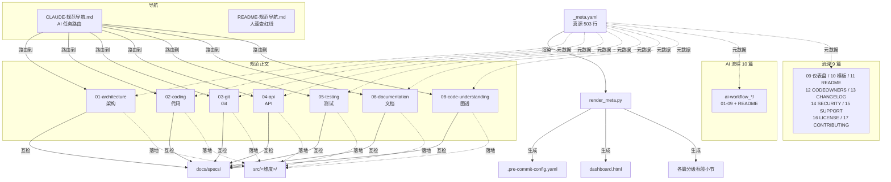

# 简报 · M1 规范正文

> 版本: v1.0 · 2026-06-10
> 3 秒读懂：17 篇规范全部以 `_meta.yaml` 为真源，改一处自动同步钩子/CI/仪表盘；01-08 是开发维度，09-17 是治理维度（GitHub 标准件 + 仪表盘 + 模板）。
> 更新: 2026-07-11

---

## 规范速览（17 篇）

| ID | 规范 | 类型 | 红线数 | L1 检测工具 | AI 任务路由 |
|----|------|------|:---:|------|------|
| **01** | 架构设计 | 开发 | 4 | importlinter | 任务=架构设计 |
| **02** | 代码编写 | 开发 | 7 | ruff + gitleaks + markdownlint | 任务=实现 |
| **03** | Git 协作 | 开发 | 5 | pre-commit + commitlint | 任务=提交 |
| **04** | API 设计 | 开发 | 7 | spectral | 任务=接口设计 |
| **05** | 测试 | 开发 | 4 | pytest --cov-fail-under | 任务=实现 |
| **06** | 文档 | 开发 | 5 | markdownlint-cli | 任务=写文档 |
| **07** | AI 协作开发流程 | 流程 | 0/7 推荐 | check_ai_workflow.py | 全部任务必读 |
| **08** | 代码理解与图谱 | 开发 | 2 | check_code_understanding.py | 任务=图谱生成 |
| **09** | 仪表盘自动生成 | 治理 | — | render_meta.py + render.py | — |
| **10** | 模板与汇报 | 治理 | — | 模板 + reports/ | — |
| **11** | README | 治理 | — | README.md 存在性 | — |
| **12** | CODEOWNERS | 治理 | — | .github/CODEOWNERS | — |
| **13** | CHANGELOG | 治理 | — | CHANGELOG.md | — |
| **14** | SECURITY | 治理 | — | SECURITY.md + gitleaks | — |
| **15** | SUPPORT | 治理 | — | SUPPORT.md | — |
| **16** | LICENSE | 治理 | — | LICENSE (MIT) | — |
| **17** | CONTRIBUTING | 治理 | — | CONTRIBUTING.md | — |

> 总红线数 **34**（01-08 汇总）；09-17 治理类无红线，由"存在性"+"格式"二维检测。

---

## 关键数字

| 指标 | 数值 |
|------|------|
| 规范总数 | 17（01-08 正文 + 09-17 元数据） |
| AI 流程文档 | 10 篇（`ai-workflow_AI协作开发流程/`） |
| 红线总数 | 34（自动检测） |
| 真源文件 | 1 份（`_meta.yaml` 503 行） |
| 导航文件 | 2 份（人入口 + AI 入口） |
| 路由覆盖率 | 100%（每篇规范都有 `l3_route` 字段） |

---

## 规范关系拓扑

---

## 核心决策

| 决策 | 选择 | 原因 |
|------|------|------|
| 规范元数据放哪 | `_meta.yaml` 单文件真源 | 改一处自动同步钩子/CI/仪表盘；避免漂移 |
| 分级标签存哪 | 在每篇规范顶部 + 由 CI 渲染 | 渲染产物不入 git 手改；保持单向同步 |
| AI 流程为什么拆成 10 篇 | 长文 > 300 行强制拆目录（ADR 0005） | 单文件阅读体验差 |
| 治理类要不要写正文 | 09-17 不写正文，仅入 `_meta.yaml` | 这类规范"存在性"即满足，不需要长文论述 |
| 双导航必要吗 | 是（CLAUDE + README） | AI 读 CLAUDE / 人读 README，硬分离避免一份两用 |

---

## 红线（动一处就阻断 commit/CI）

| 红线 | 出处 | 触发场景 |
|------|------|---------|
| 禁循环依赖 | 01 §一 | importlinter 扫到 |
| 禁 print / SQL 注入 / 明文密钥 | 02 §一 | ruff + gitleaks |
| main 禁直推 / 禁 force push | 03 §一 | pre-commit / commit-msg |
| API 必须 kebab-case 复数 | 04 §一 | spectral |
| 测试覆盖率不足 | 05 §一 | pytest --cov-fail-under |
| 文档 markdownlint 失败 | 06 §一 | lint_markdown.py |
| 双图谱缺失 | 08 §一 | check_code_understanding.py |
