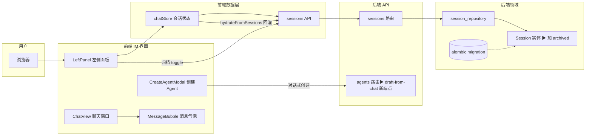

# 简报 · M1 IM 聊天补全

> 版本: v2.0 · 2026-06-09
> 3 秒读懂：IM 聊天的 4 个缺口 —— 私聊入口找不到、会话不能归档、消息操作没验证过、建 Agent 只能填表单。

---

## 功能速览

| 功能点 | 优先级 | 用户怎么做 | 系统做什么 |
|--------|:---:|-----------|-----------|
| **私聊死路修复** | P0 | 打开 AgentHub → 左侧面板有「发起私聊」按钮 | 启动时把后端 Session 回灌前端 store + 空态加 CTA |
| **对话列表归档/搜索/排序** | P0 | 右键会话 → 归档；搜索框输入关键词 | 归档走 5 层全链路（字段→表→API→前端）；搜索可选接后端 |
| **消息操作 E2E** | P1 | 回复/复制代码/Pin/Diff 预览 | 已有功能代码，补 Playwright 真浏览器截图验证 |
| **对话式创建 Agent** | P2 | 输入"帮我建一个前端审查 Agent" → 确认 | LLM 抽取 name/role/prompt → 预览草稿 → 一键创建 |

---

## 关键数字

| 指标 | 数值 |
|------|------|
| 功能点 | 4 个（P0×2 + P1×1 + P2×1） |
| 总工时 | ~23-33h（4-6 + 6-8 + 3-5 + 10-14） |
| 硬阻塞 | 2 个（alembic stamp 冲突 + LLM key + PR-01） |
| 后端零改动的功能 | 1 个（消息 E2E，纯补测试） |

---

## 接口拓扑



---

## 推荐顺序

```
第一波（P0+P1，~13-19h）           第二波（P2，~10-14h）
私聊死路修复 → 归档全链路 → 消息E2E  →  对话式创建 Agent
△ 无硬阻塞                           △ PR-01 + LLM key 双阻塞
```

---

## 核心决策

| 决策 | 选择 | 原因 |
|------|------|------|
| 私聊死路怎么修 | 加 store 回灌 + 空态 CTA，不动按钮 | 按钮早接线了，真因是后端 session 没回灌前端 |
| 归档要不要自建存储 | 走 DB 字段，沿 5 层洋葱全链路 | 归档是持久行为，不存 DB 刷新就丢 |
| 搜索要不要改后端 | 先保持纯本地，列为可选 | 当前本地搜 conversation 名够用 |
| 对话式创建怎么实现 | 新端点 LLM 抽取 + 前端聊天式 UI | 复用已有 Composer/MessageBubble 组件 |
| E2E 要不要改源码 | 不改，纯加测试文件 | MessageBubble 代码已完整，只缺证据 |

---

## 风险

| 风险 | 缓解 |
|------|------|
| alembic stamp 冲突（多 worktree） | 手动 `UPDATE alembic_version` 再 `upgrade head` |
| 功能点 4 的 LLM 凭证不可用 | 排第二波，不阻塞 P0/P1；可用 mock LLM 先做前端 |
| 功能点 4 跳过 PR-01 直接写代码 | 硬约束：04-commands 先冻结新端点 + 2 人 Approve |
