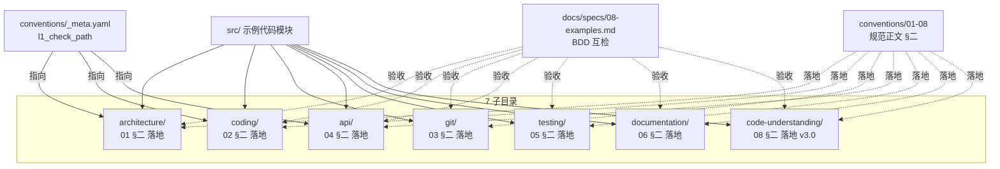

# 简报 · M3 示例代码（src/）

> 版本: v1.0 · 2026-06-10
> 3 秒读懂：7 个子目录各对应 1 篇规范 §二「落地」的可运行版本；9 个配置文件 + 多份教学 .py 文件；按规范维度分目录（**非**产品结构）。
> 更新: 2026-06-11

---

## 子目录速览（7 个）

| # | 子目录 | 对应规范 | 主要文件 | L1 检测工具 | 落地配置（规范 §二对应） |
|---|--------|---------|---------|------------|-----------------------|
| 1 | `architecture/` | 01-架构设计 | 4 层架构 + main.py + importlinter.ini | importlinter | 分层契约 + 领域层纯净 |
| 2 | `coding/` | 02-代码编写 | 命名正反例 + 错误/安全示例 + ruff.toml | ruff | E/F/N/T20/S/PLR0915 |
| 3 | `git/` | 03-Git 协作 | .gitignore + .pre-commit-config.yaml + commitlint.config.js | pre-commit + commitlint | ruff + gitleaks + commitlint |
| 4 | `api/` | 04-API 设计 | FastAPI 微服务 main.py + .spectral.yaml | spectral | kebab-case + 禁动词 + 安全声明 |
| 5 | `testing/` | 05-测试规范 | discount.py + test_discount.py + pytest.ini | pytest + pytest-cov | --cov-fail-under=80 |
| 6 | `documentation/` | 06-文档规范 | docstring_example.py + CHANGELOG.md | markdownlint | Keep a Changelog + Google docstring |
| 7 | `code-understanding/` | 08-代码理解与图谱（v3.0） | call_graph_example.py（AST 教学） | check_code_understanding.py | CodeGraph（AI）+ Understand-Anything（人）|

> **缺号说明**：07-ai-workflow（流程）不需要示例代码 —— 流程本身是文档不是代码。

---

## 关键数字

| 指标 | 数值 |
|------|------|
| 子目录数 | 7（按规范 01-06 + 08 维度分） |
| Python 源文件 | ~15 个（教学/演示用） |
| 落地配置文件 | 9 份（importlinter / ruff / pre-commit / spectral / pytest / commitlint / .gitignore / .markdownlint / spectral 衍生） |
| README-<维度>.md | 7 份（每个子目录 1 份） |
| 入口文件 | 6 个（main.py × 4 + call_graph_example.py + test_discount.py） |
| 框架依赖 | FastAPI（api/）+ pytest（testing/）+ ruff（coding/）+ import-linter（architecture/）|
| 引用 `_meta.yaml.l1_check_path` | 3 处（`src/coding/ruff.toml` / `src/architecture/importlinter.ini` / `src/api/.spectral.yaml`） |

---

## 子目录拓扑

---

## 核心决策

| 决策 | 选择 | 原因 |
|------|------|------|
| 按维度分目录（**不**按产品分层） | `src/architecture/` `src/coding/` … | 7 个子目录与 7 篇规范一一对应，查阅/对照零成本 |
| 内部演示分层用 `architecture/` | 四层架构完整跑通 | 既是规范演示，也是分层架构的可参考实现 |
| 配置文件 vs 教学 .py | 配置=规范 §二 1:1 复制；.py=正反例对比 | 配置文件让 AI 复制即用，.py 教学让人理解为什么 |
| code-understanding 教学用 AST | `call_graph_example.py` 演示 CodeGraph 底层 | 教学清晰；真实项目用 CodeGraph + Understand-Anything |
| 跨语言差异 | 统一用 Python | 一致性最高；跨语言差异在规范正文（07 §三）说明 |
| 教学反模式保留 | `naming_bad.py` 故意保留违规 | L4 规范测试断言要复用，禁 lint 自动修 |

---

## 红线（与规范互检一致）

| 红线 | 出处 | 触发检测 | 落地配置 |
|------|------|---------|---------|
| 循环依赖 / 跨层调用 | 01 §一 | importlinter | `src/architecture/importlinter.ini` |
| 禁 print / 裸 except / 调试断点 | 02 §一 | ruff | `src/coding/ruff.toml` |
| 禁明文密钥 | 02 §一 | gitleaks | `.pre-commit-config.yaml` 钩子 |
| URL 不 kebab-case / 含动词 | 04 §一 | spectral | `src/api/.spectral.yaml` |
| 测试覆盖率不足 80% | 05 §一 | pytest --cov-fail-under | `src/testing/pytest.ini` |
| 提交信息不符合 Conventional Commits | 03 §一 | commitlint | `src/git/commitlint.config.js` |
| 双图谱缺失 | 08 §一 | check_code_understanding.py | `src/code-understanding/call_graph_example.py`（教学）|
