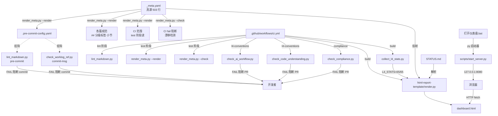

# 简报 · M4 工具脚本

> 版本: v1.0 · 2026-06-10
> 3 秒读懂：scripts/ 是把 _meta.yaml 翻译成可执行命令的桥梁；10 个脚本中 1 个是核心渲染枢纽，4 个对应规范 L1 红线，2 个是仪表盘入口，3 个是辅助工具。
> 更新: 2026-07-11

---

## 10 脚本速览

| # | 脚本 | L 级别 | 触发场景 | 对应规范/产物 |
|---|------|:---:|---------|-------------|
| 1 | `render_meta.py` | **L0 准入** | 改了 `_meta.yaml` / CI 自动 / pre-commit 钩子 | 09 仪表盘 + 03-git 钩子 |
| 2 | `check_ai_workflow.py` | **L1 红线** | CI 阶段 `l4-conventions` | 07 AI 协作（7 篇流程） |
| 3 | `check_code_understanding.py` | **L1 红线** | CI 阶段 `l4-conventions` | 08 图谱（AST 示例存在性） |
| 4 | `check_compliance.py` | **L1 红线** | CI 阶段 `compliance` | 01-08 综合合规扫描 |
| 5 | `check_worklog_ref.py` | **L1 红线** | pre-commit `commit-msg` 钩子 | 06 §2.5 + 03-git §一 |
| 6 | `collect_l4_stats.py` | **L4 测试** | CI 阶段 `build`（注入 dashboard） | 09 仪表盘（数据采集） |
| 7 | `lint_markdown.py` | **L1 红线** | pre-commit `markdownlint` 钩子 | 06 文档规范 |
| 8 | `fix_render_date.py` | **辅助** | V0.3 一次性脚本（已弃用保留） | — |
| 9 | `start_server.py` | **辅助** | 双击 `打开仪表盘.bat` / 手动预览 | 09 仪表盘 |
| 10 | `打开仪表盘.bat` | **辅助** | Windows 双击启动 dashboard | 09 仪表盘 |

> **L 级别约定**（来自 M1 设计.md §三）：L0 = 准入 / L1 = 红线 / L2 = 警告 / L3 = 路由 / L4 = 测试。

---

## 关键数字

| 指标 | 数值 |
|------|------|
| 脚本总数 | 10（含 1 个 .bat 启动器） |
| Python 脚本 | 9（render_meta + 4 check + lint + collect + start + fix） |
| 行数总计 | 1039 行（含注释和空行） |
| L1 红线脚本 | 5 个（check_*.py + lint_markdown.py） |
| L0 准入脚本 | 1 个（render_meta.py） |
| L4 测试脚本 | 1 个（collect_l4_stats.py） |
| 被 pre-commit 调用 | 2 个（lint_markdown + check_worklog_ref） |
| 被 CI 调用 | 6 个（render / check_ai / check_cu / check_compliance / collect_l4） |
| 真源渲染目标 | 4 个（pre-commit-config / convention-grade / ci range / dashboard data） |

---

## 触发场景与调用关系

---

## 核心决策

| 决策 | 选择 | 原因 |
|------|------|------|
| 渲染策略 | B3 真源+渲染（_meta.yaml 集中 + 渲染产物） | 改一处自动同步 4 个产物，避免漂移 |
| L1 检测归属 | 一篇规范 = 一个 check_*.py 文件 | 与 `_meta.yaml.l1_check` 字段一一对应，便于 CI 编排 |
| 入口脚本（仪表盘） | 跨平台 start_server.py + Windows 友好 打开仪表盘.bat | 解决 file:// 跨文件读取 + Windows 双击体验 |
| commit-msg 钩子 | 用 pre-commit 框架而非自建 | 钩子安装/升级标准化，开发者环境一致 |
| 渲染脚本 | 单体 Python 不拆包 | 370 行单文件，仅依赖 pyyaml，分包反而难复用 |
| dashboard 数据 | render_meta.py + render.py + STATUS.md 三角联动 | 元数据 + 进度 + 模板，缺一仪表盘失真 |

---

## 红线（动一处就阻断 commit/CI）

| 红线 | 出处 | 触发场景 |
|------|------|---------|
| commit message 缺 worklog 引用 | 06 §2.5 + 03-git | `check_worklog_ref.py` 拦下 |
| markdown 格式不合规 | 06 §一 | `lint_markdown.py` 拦下 |
| ai-workflow 7 篇 §一 红线缺失 | 07 | `check_ai_workflow.py` CI fail |
| 08 AST 调用图示例缺失 | 08 | `check_code_understanding.py` CI fail |
| 01-08 L1 配置缺失 | 01-08 | `check_compliance.py` CI fail |
| 渲染产物与真源漂移 | 09 | `render_meta.py --check` CI fail |
