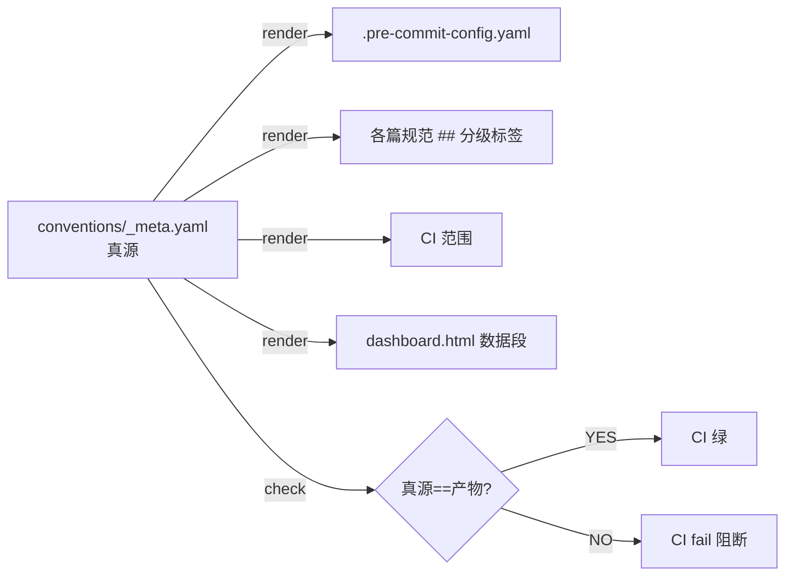

# M4 工具脚本 · 现状设计

> 版本: v1.0 · 2026-06-10
> 配套: [README.md](README.md) · [简报.md](简报.md) · [实现计划.md](实现计划.md) · [阅读笔记.md](阅读笔记.md)
> 更新: 2026-06-11

---

## 一、模块定位

### 它是什么

`scripts/` 是 devguard 的**自动化工具集**。它把 4 类上游输入（规范真源 yaml、commit message、L4 测试结果、dashboard 模板）翻译成 4 类下游产物（pre-commit 钩子、CI 阻断信号、dashboard 数据、本地预览服务）：

- **渲染枢纽**：`render_meta.py` —— 从 `_meta.yaml` 投射到 4 个产物
- **L1 红线检测**：5 个 `check_*.py` + `lint_markdown.py` —— 对应 `_meta.yaml.l1_check` 字段
- **入口工具**：2 个仪表盘启动脚本 + 1 个 L4 统计 + 1 个历史一次性脚本
- **跨平台兼容**：start_server.py 走 127.0.0.1 回环、打开仪表盘.bat 走 Windows 启动器

### 它不是什么

- **不是配置中心** —— 配置在根目录（`.pre-commit-config.yaml` / `.github/workflows/ci.yml`），scripts 只生成和验证
- **不是产品代码** —— 不参与生产运行时，只服务于仓库自身的开发闭环
- **不是规范正文** —— 规范在 `conventions/`，scripts 是规范的"执行器"
- **不是测试** —— L4 测试在 `tests/conventions/`，scripts 只采集测试结果

---

## 二、目录结构

```
scripts/
├── render_meta.py                # 370 行 · L0 准入 · 核心渲染枢纽
├── check_ai_workflow.py          # 98 行  · L1 红线 · 07 AI 流程 §一
├── check_code_understanding.py   # 66 行  · L1 红线 · 08 图谱 AST 示例
├── check_compliance.py           # 238 行 · L1 红线 · 01-08 综合合规
├── check_worklog_ref.py          # 58 行  · L1 红线 · commit-msg 钩子
├── collect_l4_stats.py           # 48 行  · L4 测试 · pytest 结果采集
├── lint_markdown.py              # 54 行  · L1 红线 · markdownlint 包装
├── fix_render_date.py            # 2 行   · 辅助   · V0.3 一次性脚本（已弃用）
├── start_server.py               # 77 行  · 辅助   · dashboard 本地预览
└── 打开仪表盘.bat                # 28 行  · 辅助   · Windows 双击启动
```

> **总数**：10 个脚本 · 1039 行 · Python 9 个 + Windows 批处理 1 个

---

## 三、核心设计：渲染枢纽 render_meta.py（L0 准入）

### 真源到下游的桥梁



### 关键设计判断

| 判断 | 选择 | 原因 |
|------|------|------|
| CLI 子命令 | `--render` / `--check` / 单 target | 同一脚本两用，CI 校验与开发者渲染无歧义 |
| 退出码 | 0=OK / 1=渲染失败 / 2=校验失败 | CI 阶段可分辨"环境故障"与"漂移违规" |
| 依赖 | 仅 pyyaml | 不引入 jinja2 / click 等，跨环境一致 |
| 钩子排序 | `pre-commit/pre-commit-hooks` 优先（最便宜） | ADR 约定：先做最便宜的检查 |
| UTF-8 强制 | `encoding="utf-8"` 显式 | 避免 Windows ANSI 损坏中文 |
| 模板版本同步 | `_meta.yaml` 改 → 同步 `docs/templates/devguard/conventions/_meta.yaml` | B3 策略的纪律落地 |

### 渲染产物（4 个）

| 产物 | 路径 | 写入策略 |
|------|------|---------|
| pre-commit 钩子 | `.pre-commit-config.yaml` | 文件头明确写"DO NOT EDIT" |
| 规范分级标签 | 各 `NN-*.md` 顶部 | CI 自动渲染，禁手改 |
| CI 范围 | `.github/workflows/ci.yml` ci 节 | 与 yaml `ci` 段对应 |
| dashboard 数据 | `dashboard.html` 模板变量 | 由 `render.py` 二次渲染 |

---

## 四、10 脚本逐个介绍

### 4.1 render_meta.py（L0 准入 · 370 行 · 核心枢纽）

- **输入**：`conventions/_meta.yaml`（503 行）
- **输出**：4 个渲染产物（见 §三）
- **触发场景**：
  - 开发者本地改了 `_meta.yaml` → 跑 `python scripts/render_meta.py --render` 同步
  - CI 阶段 `test` 自动跑 `python scripts/render_meta.py --render convention-grade` + `--check`
  - pre-commit 钩子 `meta-render`（V0.1 设计预留）作为兜底
- **核心功能**：
  - `load_meta()` —— 强 UTF-8 读 yaml，缺 `pre_commit` 节直接 fail
  - `render_pre_commit_config(meta)` —— 按 source 分组，local repo 不带 rev
  - `render_convention_grade(meta)` —— 把 `grade.red_line` 等数字渲染到各篇规范顶部
  - `--check` 模式 —— 比较当前产物与预期，漂移则 exit 2
- **关键文件/引用**：`conventions/_meta.yaml` 头部"配套文件"明确指本脚本

### 4.2 check_ai_workflow.py（L1 红线 · 98 行）

- **输入**：`conventions/ai-workflow_AI协作开发流程/` 7 篇流程文档
- **输出**：0 = 通过 / 1 = FAIL
- **触发场景**：CI 阶段 `l4-conventions` 自动跑（V6.1 引入）
- **核心功能**：
  - V9.1 章节级 L1 钩子
  - 每篇流程文档检查 §一是否含指定关键词（如"调研/背景/问题"、"迭代/实现/可观测/TDD"）
  - 比 V5.2 "关键内容"更严：每篇必须有 §一 红线
- **期望关键词表**（7 篇 × 5-7 关键词）：
  - `01-角色分工与文件体系.md` ← 角色/分工/文件/体系/AI
  - `02-第零步_调研.md` ← 调研/背景/问题/现状
  - `03-第一步_编写计划.md` ← 计划/收束节点/档位/BDD/TDD
  - `04-第二步_迭代开发.md` ← 迭代/实现/可观测/TDD/扫描/测试
  - `05-完整流程与核心原则.md` ← 原则/不越界/不黑盒/不断档/不拖欠/不积压
  - `06-第三步_收束节点.md` ← 收束/整理/测试/审计/人审/验证
  - `07-汇报.md` ← 汇报/功能点/不落盘/内联/收束报告
- **对应规范**：07 AI 协作（章节级 L1）

### 4.3 check_code_understanding.py（L1 红线 · 66 行）

- **输入**：`src/code-understanding/` 示例
- **输出**：0 = 通过 / 1 = FAIL
- **触发场景**：CI 阶段 `l4-conventions` 自动跑（V6.1 引入）
- **核心功能**：
  - V5.3 章节级 L1 钩子
  - 用 `ast.parse()` 解析 `call_graph_example.py` 检查关键函数存在：`build_graph` / `find_callees` / `add_entity`
  - 失败信息明确指出"实际函数名"便于排查
- **对应规范**：08 图谱（AST 调用图示例存在性）

### 4.4 check_compliance.py（L1 红线 · 238 行）

- **输入**：`conventions/_meta.yaml` + 多个 `l1_check_path` 文件
- **输出**：文本报告到 stdout / `--json` 输出 JSON
- **触发场景**：CI 阶段 `compliance`（阶段 4）
- **核心功能**：
  - 读 yaml 列出所有规范的 L1 配置检查表（L1_CHECKS 字典，6 类规范 × 多个检查项）
  - 对每条检查：文件存在性 → 配置关键字校验
  - 范围：01 架构（importlinter.ini）、02 代码（ruff.toml + .gitleaks.toml + .markdownlint.json）、03 Git（commitlint.config.js + .gitmessage + PR 模板）、04 API（.spectral.yaml + main.py）、05 测试（pyproject.toml）、06 文档（.markdownlint.json + README + CHANGELOG）、08 图谱（call_graph_example.py）
- **对应规范**：01-08 综合合规扫描

### 4.5 check_worklog_ref.py（L1 红线 · 58 行）

- **输入**：pre-commit 框架传入的 commit-msg 文件路径
- **输出**：0 = 通过 / 1 = FAIL
- **触发场景**：pre-commit 钩子 `commit-msg-worklog-ref` 自动跑
- **核心功能**：
  - 正则匹配 `worklogs/YYYY-MM-DD_*.md`（允许完整/相对/只文件名/链接 4 种引用形式）
  - 匹配命中即通过；不命中打印格式示例 + 豁免标记 `[skip-worklog]`
  - 红线依据：06-documentation §2.5 + 03-git §一（"汇报不断档"）
- **对应规范**：06 §2.5 + 03-git §一（人记得 + 工具拦）

### 4.6 collect_l4_stats.py（L4 测试 · 48 行）

- **输入**：`pytest tests/conventions/ -q` 子进程输出
- **输出**：stdout 最后一行 `L4_STATS=65/65`（V6.3 retry / V7.2 修订）
- **触发场景**：CI 阶段 `build` 注入 dashboard 模板
- **核心功能**：
  - V6.3 替代方案：Python 跑 pytest + 解析"= 64 passed" / "64 passed in" 两种格式
  - 比 bash grep 更稳：避免 PowerShell/ANSI 编码问题，跨平台一致
  - 失败回退输出 `L4_STATS=0/0`，CI 阶段用 `${VAR:-0}` 防御空字符串
- **对应规范**：09 仪表盘（数据采集）

### 4.7 lint_markdown.py（L1 红线 · 54 行）

- **输入**：仓库内所有 `.md` 文件（排除 `node_modules/`、`.git/`、`__pycache__/`、`dashboard.html.lock`）
- **输出**：markdownlint 退出码（0/非0）
- **触发场景**：pre-commit 钩子 `markdownlint` + CI 阶段 `lint`
- **核心功能**：
  - 解决 markdownlint-cli 附加 glob 行为：先在 Python 里列所有 .md 再传
  - 解决 Windows 命令行 ~8KB 长度限制：分批 50 个文件调用
  - 跨平台：Windows npx 是 .cmd shim，强制 `shell=True`
- **对应规范**：06 文档规范

### 4.8 fix_render_date.py（辅助 · 2 行）

- **输入/输出**：V0.3 一次性脚本，V0.3 收尾已用完
- **保留原因**：作为示例（V0.3 临时脚本模式）展示"临时脚本存档"约定
- **当前状态**：intentional empty，仅文件头说明

### 4.9 start_server.py（辅助 · 77 行）

- **输入**：可选端口参数（默认 8080）
- **输出**：HTTP server 在 127.0.0.1 绑定
- **触发场景**：开发者手动 `python scripts/start_server.py` 或双击 `打开仪表盘.bat`
- **核心功能**：
  - 解决浏览器 `file://` 协议禁止 fetch 跨文件读取 `STATUS.md` —— 必须经由 HTTP
  - `QuietHandler` 安静日志 + `Cache-Control: no-store, must-revalidate` 强制不缓存（每次刷新读到最新 STATUS.md）
  - 端口冲突自动顺延，最多 20 次尝试
  - 仅绑定 127.0.0.1 回环地址（不暴露公网）
- **对应规范**：09 仪表盘

### 4.10 打开仪表盘.bat（辅助 · 28 行）

- **输入**：无
- **输出**：调用 `start_server.py` 启动服务
- **触发场景**：Windows 用户双击
- **核心功能**：
  - `chcp 65001` 切 UTF-8 编码（避免中文乱码）
  - `where py` 优先 py 启动器，回退 `where python`，都没有则打印安装提示
  - `cd /d "%~dp0"` 切到脚本所在目录（不依赖调用方当前路径）
  - `pause` 防止窗口闪退，让用户看到启动信息

---

## 五、L 级别体系（M1 设计.md §三的落地）

scripts 模块的 10 个脚本按 M1 设计的 L 级别归类如下：

| L 级别 | 含义 | 本模块脚本 |
|:---:|------|----------|
| **L0** | 准入（pre-commit 强制 + CI 必跑） | `render_meta.py` |
| **L1** | 红线（违反即阻断 commit/CI） | `check_ai_workflow` / `check_code_understanding` / `check_compliance` / `check_worklog_ref` / `lint_markdown` |
| **L2** | 警告 | （本模块无） |
| **L3** | 路由 | （本模块无，由 `_meta.yaml.l3_route` 承担） |
| **L4** | 测试（采集 + 报告） | `collect_l4_stats` |

> 辅助类脚本（fix_render_date / start_server / 打开仪表盘）不入 L 级别体系，因为它们是工具而非检查。

---

## 六、与上游（真源）的同步纪律

```
改 _meta.yaml
    │
    ├─→ 跑 python scripts/render_meta.py --render  → 同步 4 个产物
    │
    ├─→ 同步 docs/templates/devguard/conventions/_meta.yaml（模板版本）
    │
    └─→ commit message 加 [meta] 标记
```

违反任一环节：
- `--render` 漏跑 → pre-commit 钩子兜底（如果配置了）
- 模板版本漏同步 → 新项目 fork 时渲染产物漂移
- `[meta]` 标记漏加 → 难追溯"哪些 commit 动了真源"

---

## 七、边界与降级

| 场景 | 降级行为 |
|------|---------|
| `_meta.yaml` 改了但没跑 `render_meta.py` | pre-commit 钩子 `meta-render` 兜底；否则 CI `test` 阶段 `--check` fail |
| L1 检测脚本依赖的 yaml 库缺失 | 脚本开头 `ImportError` 提示 `pip install pyyaml`，退出码 1 |
| dashboard.html 缺失 | start_server.py 启动时 `sys.exit` 报错 |
| L4 测试 0 个 | collect_l4_stats.py 输出 `L4_STATS=0/0`，dashboard 卡片显示 0/0 |
| Windows 中文路径乱码 | render_meta.py / lint_markdown.py 全部 `encoding="utf-8"` 强制 |
| 端口 8080 被占用 | start_server.py 顺延到 8081 ~ 8099，最多 20 次 |
| 临时脚本用完 | fix_render_date.py 模式：保留为示例 + intentional empty |

### 明确不做

- **不做**：把 scripts 拆成包结构（保持单文件可读性）
- **不做**：用 jinja2 渲染（避免依赖膨胀，依赖仅 pyyaml）
- **不做**：dashboard 服务做反向代理（fetch 跨域由模板变量直传解决）
- **不做**：脚本作为 Python 模块 import（每个都是 `__main__` 可执行）

---

## 八、验收标准

| 维度 | 验收方式 | 通过标准 |
|------|---------|---------|
| 真源渲染 | `python scripts/render_meta.py --check` | 退出码 0 |
| L1 检测完整 | CI 阶段 `l4-conventions` + `compliance` | 0 FAIL |
| worklog 引用 | 任意 commit-msg 不带 worklog 引用 | 被 `check_worklog_ref.py` 拦下 |
| markdown 格式 | 任意不合规 markdown 文件 | 被 `lint_markdown.py` 拦下 |
| dashboard 启动 | 双击 `打开仪表盘.bat` | 浏览器 127.0.0.1:8080 看到 dashboard.html |
| L4 统计 | CI 阶段 `build` 收集 | `L4_STATS=65/65`（当前） |
| 跨平台 | Windows + Linux 跑同一脚本 | 行为一致 |
| 行数合规 | 临时脚本存档 | `fix_render_date.py` 模式：intentional empty |
