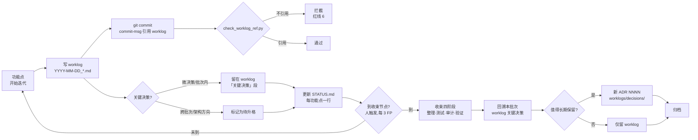

# 简报 · M5 工作日志

> 版本: v1.0 · 2026-06-10
> 3 秒读懂：31 份 worklog（`YYYY-MM-DD_<描述>.md`）记录每功能点的"做了什么 / 验证 / 决策 / 问题 / 交接"；6 份 ADR（0001-0006）只在收束节点从 worklog 升格；commit-msg 钩子强制每 commit 引用 worklog 文件（红线 6）。
> 更新: 2026-07-11

---

## worklog 类型速览

| 类型 | 命名范式 | 数量 | 典型示例 |
|------|---------|:---:|---------|
| **基础设施** | `YYYY-MM-DD_<维度>搭建.md` | 4 | `2026-05-26_基础设施搭建.md`、`2026-05-26_基础设施修正.md` |
| **模板/规约** | `YYYY-MM-DD_<主题>.md` | 5 | `2026-05-26_模板化改造.md`、`2026-05-26_02-06模板改造.md` |
| **规范重构** | `YYYY-MM-DD_<对象>v<版本>重构.md` | 3 | `2026-05-27_规范正文v2重构.md`、`2026-05-28_08规范v3.0双图谱重构.md` |
| **流程/工作流** | `YYYY-MM-DD_<主题>.md` | 7 | `2026-05-27_ai-workflow流程修订与README命名规范化.md`、`2026-05-27_汇报体系纳入工作流.md` |
| **决策/治理** | `YYYY-MM-DD_<主题>决策.md` | 2 | `2026-05-27_decisions移入worklog与约束节点决策规则.md`、`2026-05-27_汇报与收束定义修正.md` |
| **收束节点** | `YYYY-MM-DD_v<X>-<收束主题>.md` | 6 | `2026-06-08_v15-closeout-status-fix.md`、`2026-06-08_v15-section3-table-to-charts.md` |
| **断档补登** | `YYYY-MM-DD_v<X>-backfill-<范围>.md` | 1 | `2026-06-08_v15-backfill-v02-v14-worklogs.md` |
| **小型变更** | `YYYY-MM-DD_<简短>.md` | 3 | `2026-06-07_添加markdownlint.md`、`2026-06-10_claude-hud-setup.md` |
| **总计** | — | **31** | 2026-05-26 ~ 2026-06-10 跨 16 天 |

---

## 命名规约（强制）

```
worklogs/YYYY-MM-DD_<简短描述>.md
```

| 段 | 必填 | 规约 |
|----|:---:|------|
| `YYYY-MM-DD` | ✅ | 同日多份用 `_2`/`_3` 后缀（如 `_二轮审查修复.md` 实为同 2nd worklog） |
| `<描述>` | ✅ | 中文为主、kebab-case 英文为辅；动词/对象/范围清晰 |
| `.md` | ✅ | UTF-8 / LF |
| 豁免 | — | 收束节点报告可带版本前缀（`v15-...`）/ 收束主题词 |

> **与 commit-msg 引用闭环**：`scripts/check_worklog_ref.py` 用 `r"worklogs[\\/]+\d{4}-\d{2}-\d{2}[_\-\w]*\.md"` 匹配；不命中则 commit 被拦截（红线 6）。

---

## 6 份 ADR 速览

| # | 标题 | 触发批次 | 状态 |
|---|------|---------|:---:|
| **0001** | 规范体系结构 | V0.x 起步 | ✅ 已采纳 |
| **0002** | 六维度划分 | V0.x 起步 | ✅ 已采纳 |
| **0003** | AI 协作流程独立成文 | V0.x 扩展 | ✅ 已采纳 |
| **0004** | 规范移入 conventions 目录 | V0.x 重构 | ✅ 已采纳 |
| **0005** | 长文件拆文件夹 | V0.x 重构 | ✅ 已采纳 |
| **0006** | 仅在约束节点通过 worklog 整理并进行决策总结 | V0.x 重构 | ✅ 已采纳 |

> 全部 6 份位于 `worklogs/decisions/`；ADR 0006 决定**ADR 仅收束节点产出**——日常技术取舍只记 worklog「关键决策」段。

---

## 关键数字

| 指标 | 数值 |
|------|------|
| worklog 总数 | 31（2026-05-26 ~ 2026-06-10） |
| ADR 总数 | 6（0001-0006） |
| 跨天数 | 16 天 |
| 收束节点 worklog | 6（V1.5 期间集中产出） |
| 断档补登 worklog | 1（`2026-06-08_v15-backfill-v02-v14-worklogs.md`） |
| commit-msg 强引用工具 | 1（`scripts/check_worklog_ref.py`） |
| 豁免标记 | `[skip-worklog]`（仅收束/紧急 hotfix） |

---

## 生命周期：功能点 → worklog → 收束 → ADR



---

## 核心决策

| 决策 | 选择 | 原因 |
|------|------|------|
| ADR 落点 | `worklogs/decisions/`（不是 `docs/decisions/`） | ADR 0006：与 worklog 同源可追溯；不再分两条文档流 |
| ADR 创建时机 | 仅收束节点 | 避免即时形式化；经一批功能点验证后再判断"值得永久存档" |
| ADR 编号策略 | 紧随上次收束节点的最后一个 | 决策历史可线性追溯 |
| commit-msg 强引 | `scripts/check_worklog_ref.py` 正则匹配 | 红线 6：每 commit 必带 worklog 引用，"汇报不断档" |
| 豁免机制 | `[skip-worklog]` 标记 | 收束节点 / 紧急 hotfix 场景绕过 |
| 内容结构 | 五段式（做了什么 / 验证 / 决策 / 问题 / 交接） | 与 `docs/templates/worklog模板.md` 一致；可选段按需增删 |
| 命名 | `YYYY-MM-DD_<描述>.md` | 同日多份用下划线后缀区分；人/工具都好解析 |
| 收束报告 | 落盘 `docs/reports/`，不在 worklog 内 | 区别于日常 worklog：收束报告是阶段性产出 |

---

## 红线（动一处就阻断 commit/CI）

| 红线 | 出处 | 触发场景 |
|------|------|---------|
| commit-msg 必带 worklog 引用 | 06 §一 红线 6 | `check_worklog_ref.py` 拦 commit-msg 钩子 |
| worklog 模板合规 | `docs/templates/worklog模板.md` | 必填段不可缺（做了什么 / 验证结果） |
| ADR 路径 | 仅 `worklogs/decisions/` | 不接受 `docs/decisions/`（ADR 0006） |
| worklog 命名 | `YYYY-MM-DD_<描述>.md` | 正则匹配不上即阻断 |
