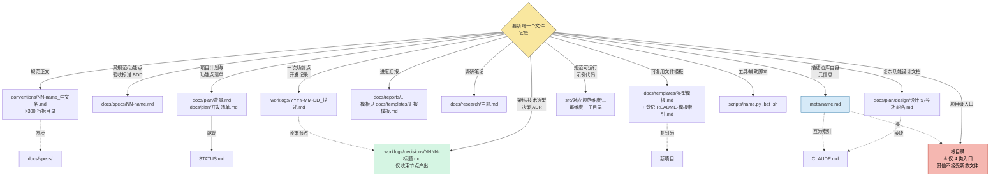

# 简报 · M6 元信息

> 版本: v1.0 · 2026-06-10
> 3 秒读懂：单文件 `FILE_GRAPH.md` 承载目录树 + 引用关系 + 决策树三大职能；13 个文件类型分支覆盖全部新增场景；与 CLAUDE.md 互为索引。
> 更新: 2026-06-11

---

## 三大职能速览

| 职能 | 章节 | 一句话 | 失败后果 |
|------|------|--------|----------|
| **目录树** | §一 | 仓库所有目录 + 文件 + 职责标注 | 根目录堆散文件 / 不知道文件放哪 |
| **引用关系图谱** | §二 | 谁依赖谁 + 改一处要同步哪些 | 改规范漏改 BDD、漏改 worklog |
| **新文件决策树** | §三 | 13 个文件类型分支的归位推理 | 新文件放错目录 / 漂移到根目录 |

---

## 关键数字

| 指标 | 数值 |
|------|------|
| 文件数 | 1 份（`FILE_GRAPH.md`，约 170 行） |
| 决策树分支 | 13 个文件类型 |
| 引用关系线条 | 11 条（覆盖 conventions ↔ specs ↔ src ↔ docs/plan ↔ worklogs ↔ scripts ↔ meta） |
| 关键同步约束 | 4 条（改规范/加功能点/dashboard 改表头/模板复制） |
| 维护频率 | 新增/移动文件时（每次都要同步） |
| 与 CLAUDE.md 关系 | 互为索引（任一边改完必须同步另一边） |

---

## 决策树 mermaid（13 个文件类型分支）

> **末端警示**：决策树最后一个分支是"项目级入口"——根目录只接受 4 类既定入口文件（CLAUDE.md / README.md / STATUS.md / dashboard.html），其他一律拒绝。

---

## 核心决策

| 决策 | 选择 | 原因 |
|------|------|------|
| 单文件还是多文件 | **单文件 `FILE_GRAPH.md`** | 三大职能互为上下文（决策树要引用目录树；引用关系要看完整结构）；拆开会失去整体视图 |
| 目录树要不要显示行数 | **不显示** | 行数是动态的，目录结构本身才是稳定的；行数漂移会让图谱维护成本上升 |
| 决策树为什么有 13 个分支 | **覆盖全量新增场景** | 经 V0.x 重整后仓库已有 13 类文件，决策树一一对应；新增第 14 类时再扩 |
| 决策树与 CLAUDE.md 重复吗 | **不重复，互为索引** | CLAUDE.md 摘要 + 本图谱详述；两边修改时同步即可，避免"双份正文漂移" |
| ADR 放 worklogs/decisions/ 而不是 meta/ | **ADR 是"决策"不是"元信息"** | worklog 记录过程，decisions 收束过程，meta 描述仓库结构——三者职能正交 |

---

## 红线（违反即导致仓库混乱）

| 红线 | 出处 | 触发场景 |
|------|------|---------|
| 根目录堆散文件 | 决策树 §三 末尾 ⚠️ | 复制粘贴临时文件到根目录 |
| 改 `conventions/` 漏改 `docs/specs/` BDD | 引用关系 §二 关键约束 1 | 改了红线数字但 BDD 没更新 |
| 新增功能点漏写 `STATUS.md` + `开发清单.md` | 引用关系 §二 关键约束 2 | 跳过了 plan 流程 |
| 改 `_meta.yaml` 没同步模板版本 | M1 模块红线（不属本模块，但与本图谱相关） | `docs/templates/devguard/conventions/_meta.yaml` 漏改 |
| 改目录结构没同步本图谱 | §一 维护规则 | 移了文件但 `FILE_GRAPH.md` 没更新 → 双轨漂移 |
