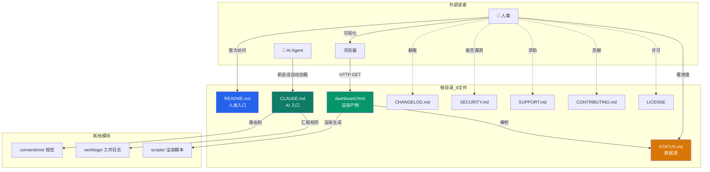

# 简报 · M7 根目录顶层入口

> 版本: v1.0 · 2026-06-10
> 3 秒读懂：devguard 根目录只放 9 个固定入口文件，5 件 GitHub 标准件 + 4 件项目特色件，缺一不可、互不重位；核心铁律是"人读 README、AI 读 CLAUDE.md"。

---

## 9 文件速览

| # | 文件 | 类型 | 受众 | 角色 | 真源关系 |
|---|------|------|------|------|---------|
| 1 | **README.md** | GitHub 标准 | 👤 人类 | 人类入口：项目说明 + 5 步快速开始 + 目录 + FAQ | 自包含（人工编辑） |
| 2 | **CLAUDE.md** | 项目特色 | 🤖 AI | AI 入口：自动加载的完整项目上下文（目录/规则/任务路由） | 自包含（人工编辑） |
| 3 | **STATUS.md** | 项目特色 | 👤+🤖 | 进度数据源：表格化的功能点状态 + 收束节点历史 | 自包含（人工编辑，被 dashboard 解析） |
| 4 | **dashboard.html** | 项目特色 | 👤 人类 | 可视化进度面板（HTTP 启动，不是 file:// 打开） | **渲染产物**：由 `STATUS.md` + `_meta.yaml` 解析 |
| 5 | **CHANGELOG.md** | GitHub 标准 | 👤 人类 | 版本变更日志（Keep a Changelog + SemVer） | 自包含（人工编辑） |
| 6 | **SECURITY.md** | GitHub 标准 | 👤 人类 | 安全策略：私下报告漏洞 + 24h/7d/30d SLA | 自包含（人工编辑） |
| 7 | **SUPPORT.md** | GitHub 标准 | 👤 人类 | 支持渠道表：Issues / Discussions / 私信 | 自包含（人工编辑） |
| 8 | **CONTRIBUTING.md** | GitHub 标准 | 👤 人类 | 贡献指南：行为准则 + PR 流程 + commit 类型 | 自包含（人工编辑） |
| 9 | **LICENSE** | GitHub 标准 | 👤 人类 | MIT 许可证（Copyright 2026 袁） | 自包含（一次性） |

---

## 关键数字

| 指标 | 数值 |
|------|------|
| 顶层文件总数 | 9（5 GitHub 标准 + 4 项目特色） |
| AI 入口 | 1（`CLAUDE.md`） |
| 人类入口 | 6（README/CHANGELOG/SECURITY/SUPPORT/CONTRIBUTING/LICENSE） |
| 人机共用 | 1（`STATUS.md`） |
| 渲染产物 | 1（`dashboard.html`，由 `STATUS.md` 解析） |
| 起步即有 | 4（V0.x 起步即建立 CLAUDE/README/STATUS/dashboard） |
| 逐步补齐 | 5（V1.0+ 补齐 CODEOWNERS/CHANGELOG/SECURITY/SUPPORT/LICENSE/CONTRIBUTING） |

---

## 角色矩阵（9 文件 × 角色 × 受众 × 真源关系）

| 文件 | 角色 | 读者 | 写入者 | 真源 | 受谁解析 |
|------|------|------|--------|------|---------|
| README.md | 项目门面 | 人类首次访问 | 人类 + AI（改后 AI 汇报） | 自身 | 没人解析 |
| CLAUDE.md | AI 上下文 | AI Agent | 人类 + AI（改 AI 行为时） | 自身 | AI 启动会话时自动加载 |
| STATUS.md | 进度数据源 | 人 + AI | 人类 + AI（每功能点必更） | 自身 | dashboard.html |
| dashboard.html | 可视化面板 | 人类 | 渲染脚本（`render.py`） | **STATUS.md** | 浏览器（HTTP 启动） |
| CHANGELOG.md | 版本日志 | 人类 | 人类 | 自身 | 没人解析 |
| SECURITY.md | 安全策略 | 漏洞报告者 | 人类 | 自身 | 没人解析 |
| SUPPORT.md | 支持渠道 | 求助者 | 人类 | 自身 | 没人解析 |
| CONTRIBUTING.md | 贡献指南 | 贡献者 | 人类 | 自身 | 没人解析 |
| LICENSE | 法律条款 | 任何使用者 | 人类（一次性） | 自身 | 没人解析 |

---

## 关系拓扑

---

## 核心决策

| 决策 | 选择 | 原因 |
|------|------|------|
| AI 入口叫 CLAUDE.md 而不是 AI.md | 沿用 Claude Code 约定 | 工具默认自动加载该文件，0 配置即生效 |
| 人 vs AI 是否合并 README | 强分离（双件套） | worklog 2026-05-27 决定：一份文档两用必妥协 |
| STATUS 是不是真源 | 是真源 | dashboard 解析它；改 STATUS → 必跑 `render.py` |
| dashboard 用什么技术 | 纯静态 HTML（HTTP 启动） | 纯静态 + CSP 头保证安全；`file://` 协议下 fetch 失败故必须 HTTP |
| 治理文件谁写 | 人类 | 治理类（SECURITY/LICENSE/SUPPORT/CONTRIBUTING）几乎不需改，1 次写好 |
| LICENSE 选什么 | MIT | 商用/修改/分发最自由；与"通用开发规范"的复用定位匹配 |
| 根目录收多少文件 | 9 件，禁加新散文件 | FILE_GRAPH.md "项目级入口"节明文约束 |

---

## 红线（动一处就阻断 commit/CI）

| 红线 | 出处 | 触发场景 |
|------|------|---------|
| 根目录加散文件 | FILE_GRAPH §三决策树 | "项目级入口"节明文"⚠️ 除这些既定入口外，根目录不接受新散文件" |
| 9 文件名错拼 | GitHub 渲染约定 | `readme.md` / `claude.md` 等大小写错乱，GitHub 不能识别 |
| CLAUDE.md 改人话风格 | worklog 2026-05-27 | CLAUDE 是 AI 唯一权威上下文，**必须**保持机器友好结构 |
| README.md 改成机器话 | 同上 | README 是人类友好导航，**必须**保持 🧭 风格 |
| dashboard.html 双击 file:// 打开 | 06 文档规范 + worklog | 浏览器 fetch 失败导致 STATUS 表格不显示 |
| LICENSE 文件缺失 | 06 文档规范 | 治理类"存在性即满足"，CI `compliance` 阶段阻断 |
| CHANGELOG 不按 SemVer | 13-changelog 规范 | Keep a Changelog 1.1.0 格式 + SemVer 2.0.0 |
