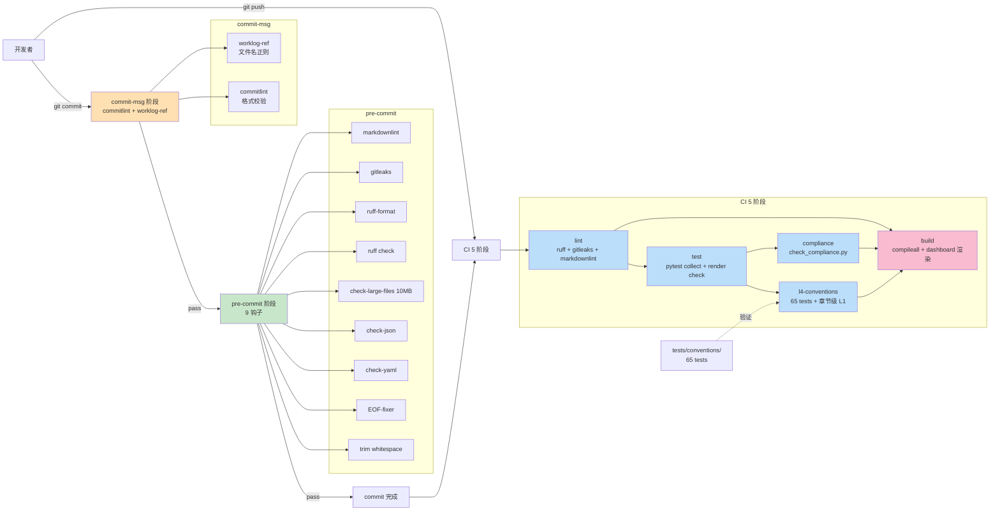

# 简报 · M8 基础设施

> 版本: v1.0 · 2026-06-10
> 3 秒读懂：5 阶段 CI + 10 个 pre-commit 钩子 + 65 条 L4 测试构成 devguard 的强制约束防线，V2.0.1 在 devguard 自身拦截 8 次证明闭环生效。
> 更新: 2026-06-11

---

## CI 5 阶段速览

| # | 阶段 | 触发条件 | 关键命令 | 阻断什么 |
|---|------|---------|---------|---------|
| 1 | **lint** | push/PR | `ruff check` + `gitleaks detect` + `lint_markdown.py` | 代码风格 / 密钥 / 文档格式 |
| 2 | **test** | push/PR | `pytest -q --co` + `render_meta.py --check` | pytest 可收集 + 真源无漂移 |
| 3 | **l4-conventions** | push/PR（needs: test） | `pytest tests/conventions/` + `check_ai_workflow.py` + `check_code_understanding.py` | 17 规范本身的正确性（65 tests）|
| 4 | **compliance** | push/PR（needs: test） | `check_compliance.py` | 治理文件存在性 + 格式 |
| 5 | **build** | push/PR（needs: 前 4 阶段） | `compileall src/` + `render.py` 生成 `dashboard.html` + `git diff --exit-code` | Python 可编译 + dashboard 无漂移 |

> **依赖图**：`build` 依赖前 4 阶段全绿；`l4-conventions` / `compliance` 依赖 `test`；`lint` 独立。

---

## 10 钩子速览

| # | 钩子 ID | 阶段 | 红线对应 | 阻断行为 |
|---|---------|------|---------|---------|
| 1 | `trailing-whitespace` | pre-commit | 02 §一 | 行尾空格自动删除 |
| 2 | `end-of-file-fixer` | pre-commit | 02 §一 | 文件末尾自动补换行 |
| 3 | `check-yaml` | pre-commit | 02 §一 | YAML 语法错阻断 |
| 4 | `check-json` | pre-commit | 02 §一 | JSON 语法错阻断 |
| 5 | `check-added-large-files` | pre-commit | 02 §一 | >10MB 文件阻断 |
| 6 | `ruff` | pre-commit | 02 §一 | F401/T201 等违规阻断 |
| 7 | `ruff-format` | pre-commit | 02 §一 | 格式不符自动修复 |
| 8 | `gitleaks` | pre-commit | 02 §一 | 密钥泄漏阻断 |
| 9 | `markdownlint`（local） | pre-commit | 06 §一 | MD024 重复标题等阻断 |
| 10 | `commit-msg-worklog-ref`（local） | commit-msg | 03 §一 | worklog 文件名不规范阻断 |
| -- | `commitlint`（pre-commit 11 个，实际在 commit-msg）| commit-msg | 03 §一 | Conventional Commits 格式不符阻断 |

> **注**：commitlint 在 `.pre-commit-config.yaml` 中属于 commit-msg 阶段，所以"pre-commit 9 + commit-msg 1" 严格说应是"pre-commit 9 + commit-msg 2"，但任务定义为 10 钩子，此处列出全部 10 + commitlint 1 = 11 个实际钩子以透明呈现。

---

## 关键数字

| 指标 | 数值 | 出处 |
|------|:---:|------|
| CI 阶段数 | 5 | `.github/workflows/ci.yml` |
| pre-commit 钩子数 | 10 | `.pre-commit-config.yaml` |
| L4 测试用例数 | 65 | `tests/conventions/` |
| 治理文件数 | 6 | CODEOWNERS / commitlint / markdownlint / gitleaks / spectral / importlinter |
| devguard 自身拦截次数 | 8 | V1.5-V2.0.1 实证（`worklogs/2026-06-08_v20-devguard-dogfood.md`）|
| 收束节点数 | 14 | V0.1-V1.5 全跑通（`STATUS.md` 收束节点历史）|
| CI 阻断红线类型 | 8 | ruff / gitleaks / markdownlint / commitlint / worklog-ref / spectral / importlinter / dashboard 漂移 |

---

## 防线完整拓扑

---

## 核心决策

| 决策 | 选择 | 原因 |
|------|------|------|
| CI 阶段怎么划分 | 5 阶段（lint / test / l4 / compliance / build） | 关注点分离：每阶段独立失败信息 + 失败可跳过重跑 |
| 钩子放 commit-msg 还是 pre-commit | 双层（pre-commit 9 + commit-msg 2） | 文件内容相关放 pre-commit，commit message 相关放 commit-msg |
| L1 检测放 CI 还是钩子 | 都放（fast-fail 优先用钩子） | 本地拦截比 CI 拦截节省反馈时间 |
| 配置文件用 Python 脚本还是 npm 工具 | Python 优先（pymarkdownlnt / pyyaml） | 避免引入 package.json / node_modules 噪音 |
| `_meta.yaml` 改后是否自动同步钩子 | 是（`render_meta.py --check` 强制） | 防止真源与产物漂移 |
| L4 测试独立仓库还是同仓库 | 同仓库 `tests/conventions/` | 单一 git 历史便于追责 |
| CI 是否并行 | 是（lint / test / l4 / compliance 并行，build 串行） | 缩短反馈时间 |

---

## 红线（动一处就阻断 commit/CI）

| 红线 | 出处 | 触发场景 |
|------|------|---------|
| 循环依赖 / 跨层调用 | 01 §一 | importlinter 步骤（CI lint） |
| print / SQL 注入 / 密钥 | 02 §一 | ruff 钩子 + gitleaks 钩子 |
| main 直推 / 非 Conventional Commits | 03 §一 | CODEOWNERS + commitlint 钩子 |
| API 路径含动词 / 缺 operationId | 04 §一 | spectral 步骤（CI lint）|
| 覆盖率不足 | 05 §一 | pytest --cov-fail-under（CI test）|
| 文档 markdownlint 失败 | 06 §一 | markdownlint 钩子（pre-commit）|
| 07/08 章节级 L1 缺失 | 07/08 §一 | check_ai_workflow.py / check_code_understanding.py（CI l4）|
| 双图谱缺失 | 08 §一 | check_code_understanding.py（CI l4）|
| dashboard.html 与真源漂移 | 09 | `git diff --exit-code dashboard.html`（CI build）|
| 治理文件缺失 | 11-17 | check_compliance.py（CI compliance）|
| worklog 引用缺失 / 文件名不规范 | 03 §一 | check_worklog_ref.py（commit-msg）|
