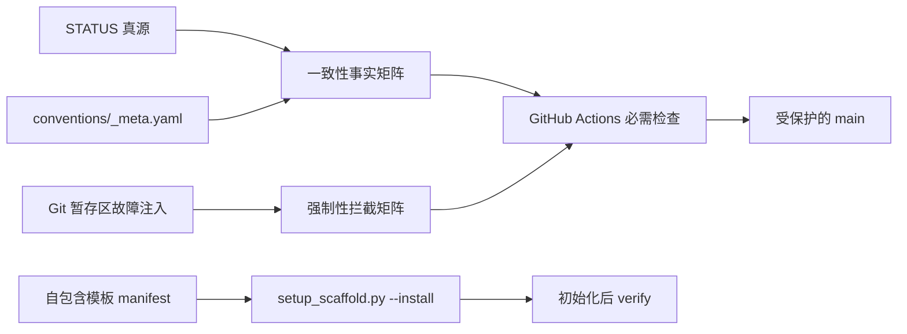

# 设计提案：devguard 一致性、强制性与易部署性修复

> 更新: 2026-07-11 | 范围: P0/P1 | 状态: Owner 已拍板，平台保护待认证回读

## 背景

现有仓库已经有规范、钩子、CI 和模板，但审计发现若干机制只检查“文件存在”或依赖手工复制，无法证明真实的一致性与拦截能力；模板复制后也缺少运行依赖、双阶段 hook 和跨平台入口。与此同时，`STATUS.md`、`CLAUDE.md` 与 `docs/plan/开发清单.md` 的 49/46/35 口径互相冲突。

## 目标

- 一致性由真实事实矩阵计算，得分必须 `>= 80%`，低于阈值时命令和 CI 失败。
- 强制性由隔离临时仓库中的故障注入计算，拦截率必须 `>= 90%`，低于阈值时命令和 CI 失败。
- 新项目通过一条跨平台 Python 命令完成骨架复制、依赖安装、双阶段 hook 安装和验收。
- `STATUS.md` 作为进度真源，开发清单和 AI 上下文保存同值机器标记并接受自动校验。
- `main` 通过 GitHub 分支保护强制 PR、必需 CI、禁止 force push 和删除。

## 方案

实施分为三个可独立验收的交付项：

| 功能点 | 优先级 | 交付内容 | 证据 |
|---|:---:|---|---|
| #47 | P0 | 渲染器、CI、LICENSE/CODEOWNERS 原生语义修复 | 聚焦测试 + 全量 CI |
| #48 | P0 | 一致性事实矩阵与至少 10 项故障注入拦截矩阵 | 机器可读分数 + 阈值退出码 |
| #49 | P1 | 自包含模板、一键初始化、跨平台 dashboard 与分支保护 | 临时目录真实初始化 E2E + GitHub API 回读 |

## 影响范围

- 真源与投影：`STATUS.md`、`CLAUDE.md`、`docs/plan/开发清单.md`。
- 强制链：`conventions/_meta.yaml`、`.pre-commit-config.yaml`、`scripts/check_*.py`、`.github/workflows/ci.yml`。
- 初始化链：`scripts/setup_scaffold.py`、`docs/templates/devguard/`、`README.md`、模板索引。
- 验收链：`tests/conventions/`、BDD、worklog、ADR、收束报告与 GitHub 分支保护。

## 风险

| 风险 | 缓解 |
|---|---|
| 为达阈值而写死分数 | 分数只由可复跑检查的通过数/总数计算，并测试失败路径 |
| 初始化覆盖已有项目 | 默认拒绝非空目标；显式参数也只允许受控目标 |
| 模板与根仓继续漂移 | manifest 声明核心/可选文件，初始化后立即 verify |
| 单人仓库被审批规则锁死 | 强制 PR 和必需检查，但审批人数设为 0；保留审计记录 |
| 外部工具暂不可用 | 结果按“通过/失败/未执行”分开，未执行不得计为通过 |

## Owner 决策

- [x] 2026-07-10：先触发收束，再继续 P0/P1 修复。
- [x] 2026-07-10：一致性最低 80%，强制性拦截率最低 90%。
- [x] 2026-07-10：目标是一键初始化，并配置 GitHub `main` 硬闸门。
- [x] 2026-07-10：进度口径采用 49 个可编号交付项，历史 36–46 补号，本轮为 47–49。

当前无待拍板项。
