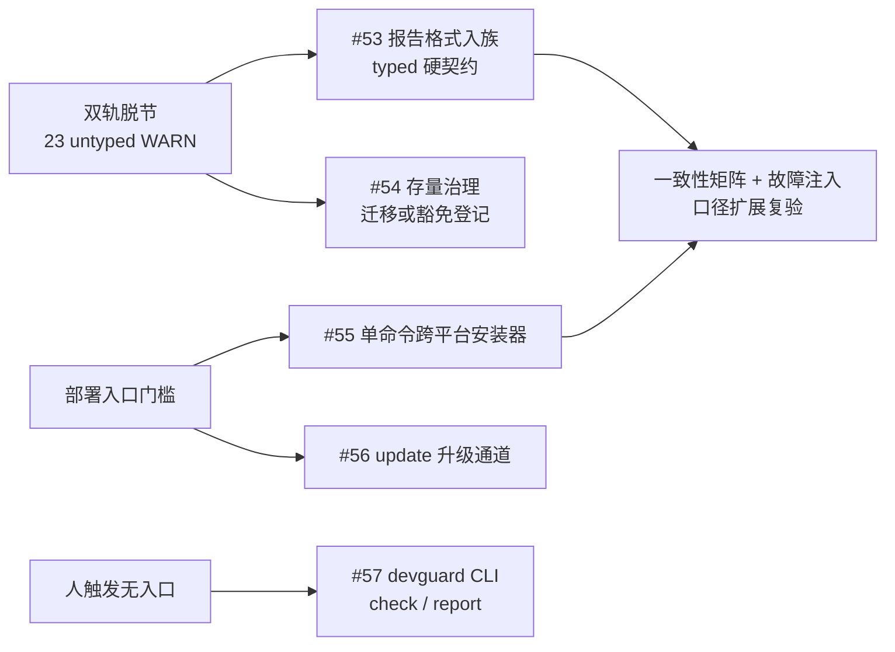

# 设计提案：报告格式入族与一键部署性提升

> 更新: 2026-07-17 | 范围: P1/P2 | 状态: 待 Owner 拍板

## 背景

2026-07-17 审查修复批次（PR #6）及验收报告撰写过程暴露两个一致性问题：

1. **报告格式双轨脱节**。`04-长程开发 §五` 与 `08-汇报收束 §1.3` 把留档报告路由到 `docs/templates/汇报模板.html`（8 要素契约，`doc-template: report` 硬门禁）；但 `final-report-template/README.md` 自述"后续每次阶段性汇报、收束报告都按这个标准出"，且实际成品（`2026-06-08_merged_report`、`2026-07-11_v2.1_收束报告`、`2026-07-17_审查修复_验收报告`）全部是不带类型声明的高密度风。`check_html_artifact.py --all` 实测：31 个受查 HTML 中 23 个 untyped WARN——**被门禁保护的格式无人使用，真正使用的格式没有门禁**。
2. **一键部署性差距**。`setup_scaffold.py` 内核完备（显式 manifest / 事务回滚 / dry-run / verify / hooks 串联），但入口仍依赖本机预装 Python 3.11+ 与手动长命令；README 初始化示例仅 Windows PowerShell 版；已部署项目无 `update` 升级通道；人手动触发环节（收束 / 审查 / 报告）无统一 CLI 入口。

Owner 2026-07-17 拍板：不做 ECC 式全局自动触发，路线为"**一键部署 + 人手动触发**"。

## 目标

- final-report 纳入模板族：新增 `doc-template` 类型与结构契约，`check_html_artifact.py` 对其硬校验；存量 untyped 有明确的迁移/豁免路径。
- 规范路由澄清：8 要素是**内容要素**，final-report 是**版式标准**；`汇报模板.html` 重新定位为轻量场景。
- 一键部署：单命令跨平台安装（macOS / Linux / Windows），已部署项目可 `update` 跟随模板升级，人触发环节 CLI 化。
- 全部新机制 fail-closed 且可测，纳入一致性事实矩阵与故障注入口径。

## 方案

实施分两条线，可独立验收：

| 功能点（建议编号） | 优先级 | 交付内容 | 证据 |
|---|:---:|---|---|
| #53 报告格式入族 | P1 | `doc-template: final-report` 类型契约（hero / kpi-row / TOC / ≥2 mermaid / verdict 结构锚点）+ `check_html_artifact.py` 扩展 + 规范路由澄清（04 §五 / 08 §1.3 / 两个模板 README） |  typed 硬校验实测 + 新测试 |
| #54 存量 untyped 治理 | P2 | 23 个存量 HTML 逐个迁移加声明或登记 `meta/豁免清单.md` | `--all` 审计 WARN 清零或全部可审计 |
| #55 单命令跨平台安装器 | P1 | curl / irm 一键引导脚本（检测/引导 python → 调 `setup_scaffold.py`），README 补 macOS/Linux 示例 | 三平台干净环境 E2E |
| #56 update 升级通道 | P2 | `setup_scaffold.py --update`：manifest 对比 + 本地修改检测 + 原子替换 + drift 报告 | 故障注入（本地改动不得被静默覆盖） |
| #57 人触发 CLI | P2 | `devguard check`（全门禁一键）+ `devguard report`（final-report 骨架渲染） | 仓外项目实测 |

## 影响范围

- 模板族与门禁：`docs/templates/`、`scripts/check_html_artifact.py`、`tests/conventions/test_html_artifact.py`、`conventions/_meta.yaml`（如注册新类型）
- 规范文档：`04-长程开发 §五`、`08-汇报收束 §1.3`、`final-report-template/README.md`、`汇报模板.html` 头注、对应 BDD
- 部署链：`scripts/setup_scaffold.py`、`README.md`、模板索引、新增安装器脚本（放置先查 `meta/FILE_GRAPH.md`）
- 验收链：`tests/conventions/` 新测试、worklog、收束报告

## 风险

| 风险 | 缓解 |
|---|---|
| final-report 契约过严误伤存量 | 契约只验结构锚点不验逐字；存量走 #54 迁移或豁免登记 |
| update 通道覆盖用户定制 | 默认拒绝有本地修改的文件，drift 报告 + 显式 `--force` |
| 安装器引导 python 失败 | fail-closed 明确报错并给手动指引，不静默降级 |
| 范围膨胀 | #53 + #55 先行一批，其余第二批；收束节点按预设硬闸门执行 |

## Owner 决策

- [ ] 功能点编号 #53-#57 与批次划分（建议 #53 + #55 先行）
- [ ] final-report 契约锚点集合（建议：hero / kpi-row / TOC / ≥2 mermaid / verdict）
- [ ] 存量 23 个 untyped：逐个迁移 or 豁免清单登记（或按目录分批）
- [ ] 安装器形态：curl/irm 引导脚本 vs pipx 包 vs 仅文档快捷命令
- [ ] CLI 命名与边界：`devguard check` / `devguard report` 是否纳入 scaffold core manifest
