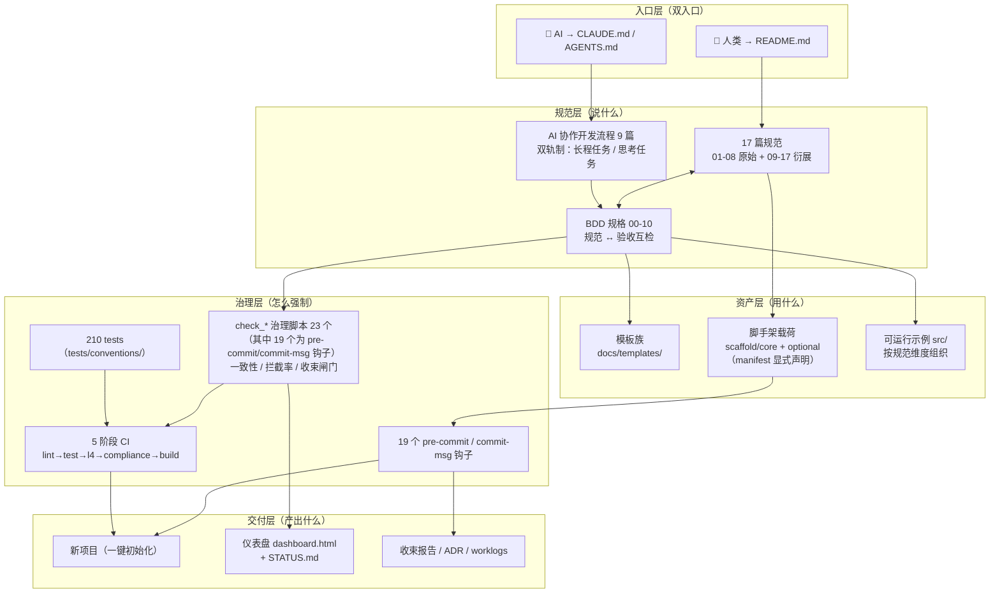
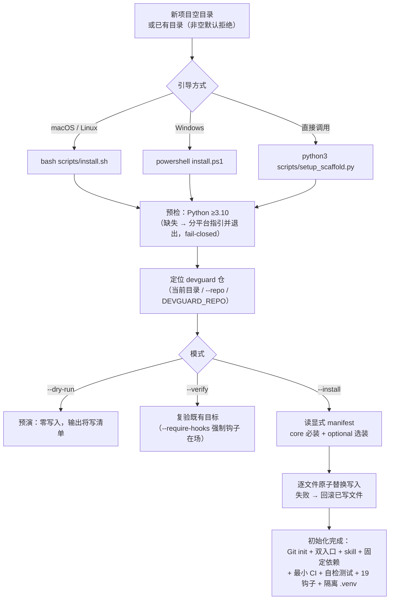
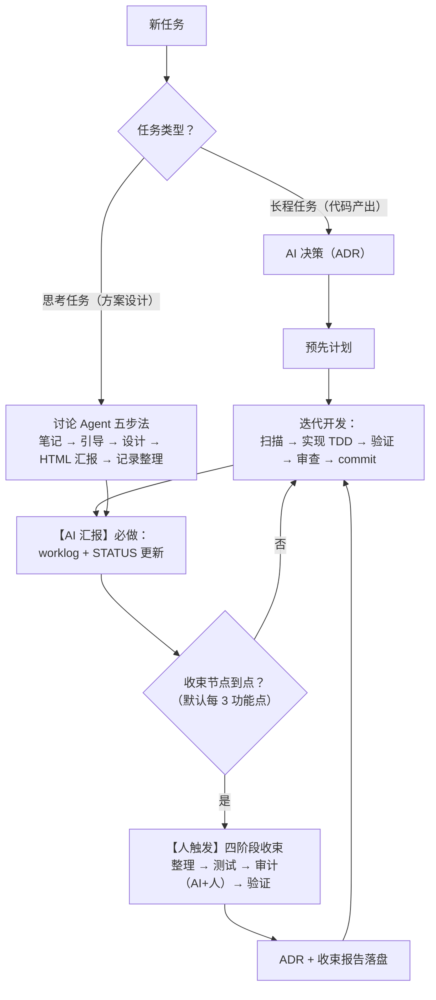
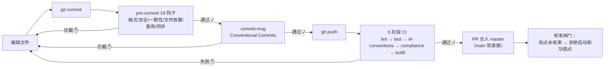
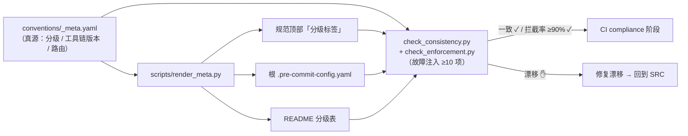

# 项目介绍 · devguard（PRD 不变量）

> **本文档是本项目的 PRD 与整理工作的验收基准（不变量契约）。**
> 更新: 2026-08-13
>
> - 本文档描述 devguard **应当是什么样**（目标态），不是现状快照。现状数据以 `STATUS.md` 为真源。
> - **任何整理、重构、优化工作，不得破坏第五节「不变量清单」中的任何一条**；与不变量冲突的改动需先修订本文档并经 Owner 拍板。
> - 术语与流程定义以 `conventions/ai-workflow_AI协作开发流程/` 为最高依据，本文档只做体系级描述，不重新定义流程。

---

## 一、项目定位

**devguard 是一套"项目开发初始体系"：把通用开发规范、AI 协作流程、可执行治理闸门与一键初始化打包，让任何新项目（或个人/团队）在单条命令内获得一套自洽、可强制、可验证的开发底座。**

它解决四类问题：

| 问题 | devguard 的答案 |
|------|----------------|
| 新项目启动无统一基准，风格靠人记 | 17 篇规范 + 9 篇 AI 协作流程，随项目初始化即自带 |
| 规则写了没人执行，Review 靠人肉 | 19 个提交钩子 + 5 阶段 CI + 故障注入测试，机器拦截 |
| AI 协作无结构，会话记忆不连续 | CLAUDE.md/AGENTS.md 双入口 + skills-first + worklog/STATUS 强制汇报 |
| 模板项目复制靠 cp，夹带垃圾 | 显式 manifest 脚手架 + 事务化原子写入 + dry-run/verify |

---

## 二、体系全景



**一句话读图**：入口层决定"谁在看" → 规范层定义"该怎么做" → 资产层提供"可复制的东西" → 治理层用机器保证"不做就拦截" → 交付层产出"新项目与过程证据"。

---

## 三、核心工作流

### 3.1 新项目初始化（易部署性主链路）



### 3.2 双轨任务流程（AI 协作主链路）



### 3.3 治理强制链（强制约束性主链路）



### 3.4 真源数据流（稳定性主链路）



**真源原则**：`_meta.yaml` 是唯一手维护源头；渲染产物（分级标签、pre-commit 配置、README 表）禁止手改；漂移由 CI 与故障注入测试兜底。

---

## 四、目录体系

```
devguard/
├── conventions/            # 规范正文：17 篇 + ai-workflow 流程 9 篇 + 双导航
├── docs/
│   ├── plan/               # 计划：背景 + 开发清单 + design/ + 本 PRD
│   ├── specs/              # BDD 规格 00-10
│   ├── templates/          # ★模板权威（含 scaffold 一键初始化载荷）
│   ├── reports/            # 收束报告 / 验收报告
│   ├── research/           # 调研产出
│   └── 历史文件/            # 只读归档（v1.0 旧版流程等）
├── src/                    # 可运行示例（按规范维度）
├── scripts/                # 治理脚本 + 渲染器 + 安装器
├── tests/                  # 210 测试（一致性 / 强制力 / 性能基线）
├── worklogs/               # 工作日志 + decisions/（ADR）
├── meta/FILE_GRAPH.md      # ★文件放置权威（新文件先查决策树）
├── CLAUDE.md               # AI 入口（本仓实例）
├── README.md               # 人类入口（本仓实例）
├── STATUS.md               # 进度数据源（dashboard 解析）
└── dashboard.html          # 可视化面板
```

> 文件放置以 `meta/FILE_GRAPH.md` 决策树为唯一权威；本图只做概览，不替代决策树。

---

## 五、不变量清单（PRD 硬契约）

> 整理/优化工作的验收基准。**破坏任意一条 = 未通过**。
> 每条附「验证方式」，优先自动化；无法自动化的为人工检查项。

### A. 易部署性

| ID | 不变量 | 验证方式 |
|----|--------|---------|
| D1 | 全新环境单命令可初始化出可用项目（bash / PowerShell / 直接调用三路等价） | `setup_scaffold.py --dry-run` 零写入预演 + 真机 E2E 演示 |
| D2 | 初始化载荷由显式 manifest（core/optional）声明，**禁止夹带** devguard 自身资产（worklogs、node_modules、.venv 等） | manifest 清单比对 + E2E 产物 diff |
| D3 | 初始化具备事务语义：任何一步失败回滚已写文件，目标目录不留半成品 | 故障注入测试（中断写入 → 校验目录） |
| D4 | 预检 fail-closed：Python 缺失/版本不足、仓定位失败时给出明确指引并退出，不静默降级 | E2E 注入缺失场景 |
| D5 | 提供 `--verify` 复验能力，`--require-hooks` 强制钩子在场 | E2E 复验既有目标 |
| D6 | 不修改用户全局 Git 配置；与既有 ECC/全局 hooksPath 可共存（串联而非覆盖） | E2E 双钩子场景 |

### B. 强制约束性

| ID | 不变量 | 验证方式 |
|----|--------|---------|
| C1 | 每篇规范有对应自动检测（L1 检测），规范 ↔ BDD ↔ 闸门一一可追溯 | `render_meta.py --check` + specs/ 互检 |
| C2 | 提交前拦截完整：19 个钩子（格式/安全/一致性/提交格式/worklog/STATUS/文件放置/豁免/同步/收束）全部在场且可执行 | `pre-commit run --all-files` + `check_enforcement.py` |
| C3 | 提交后拦截完整：5 阶段 CI（lint/test/l4-conventions/compliance/build）全部在 .github/workflows/ 且与本地闸门同源 | CI 配置比对 + 故障注入 |
| C4 | 收束闸门硬执行：到点未收束，AI 拒绝开始新功能点 | `check_convergence_gate.py` |
| C5 | 密钥/敏感信息在提交前被拦截（gitleaks） | pre-commit 故障注入 |
| C6 | 豁免（exemption）可审计：每一次破例有记录、有所有者、有到期 | `check_exemption_log.py` |

### C. 稳定性

| ID | 不变量 | 验证方式 |
|----|--------|---------|
| S1 | 工具链版本单一真源：`_meta.yaml` 与 CI、pre-commit、requirements、pyproject、脚手架载荷**全部一致**，零漂移 | `check_consistency.py`（一致性事实矩阵 ≥95%） |
| S2 | 测试基线可复现：全新 `.venv` 按固定依赖安装后 210 tests 全绿 | 自举重建脚本 + `pytest tests/` |
| S3 | 强制力有量化的故障注入证明：隔离 Git 故障注入拦截率 ≥90% | `check_enforcement.py` |
| S4 | 渲染产物禁止手改：分级标签/README 分级表/pre-commit 配置漂移即 CI fail | `render_meta.py --check` 入 CI |
| S5 | 文档与代码同 PR：改规范必须同步 BDD，动落地配置必须同步 src/ 示例 | `check_doc_sync.py` |
| S6 | 汇报必做：每功能点 worklog + STATUS 更新，无断档 | `check_worklog_ref.py` + `check_status.py` |
| S7 | 进度数据单真源：STATUS.md → dashboard 自动渲染，不手改 HTML | `render_dashboard.py` + 渲染产物比对 |

### D. 通用（贯穿三特性）

| ID | 不变量 | 验证方式 |
|----|--------|---------|
| G1 | 人/AI 双入口持续有效：README（人）与 CLAUDE/AGENTS（AI）角色分离、互不替代 | `check_claude.py` |
| G2 | 术语与流程不漂移：任何体系描述不得重新定义 ai-workflow 既有术语（双轨制/收束节点/真源等） | 人工检查（文档审查） |
| G3 | 新增/移动文件必须先查 `meta/FILE_GRAPH.md` 决策树，并同步更新图谱 | `audit_file_placement.py` |
| G4 | ADR 仅收束节点产出，日常决策记 worklog「关键决策」段 | 人工检查（收束审计） |
| G5 | 技术债有登记、有归属节点、不无限积压 | STATUS.md 技术债表 |

---

## 六、与现状的对照（整理路线）

> 本 PRD 落盘后，按以下顺序开展整理。每阶段完成时对照第五节逐条验收。

| 阶段 | 工作 | 主要验收不变量 |
|------|------|--------------|
| 1 整理 | 未提交改动合规入库；历史文件去留拍板；.workbuddy 清理；FILE_GRAPH 同步 | G3, C2, S6 |
| 2 修复 | venv 可复现重建；ruff 钉版对齐；install.sh 健壮性（ensurepip 预检/失败清理） | S2, S1, D4, D3 |
| 3 优化 | 一键自检脚本；约束覆盖率矩阵；版本真源校验入 CI；跨平台 CI | D1-D6, B 全部, S1-S4 |

> 现状详情（测试数、钩子数、阻塞项、技术债）以 `STATUS.md` 为真源，此处不复制。

---

**维护者**：袁 (xiangbianpangde) ｜ **版本**：PRD v1.0 ｜ **许可**：MIT License
