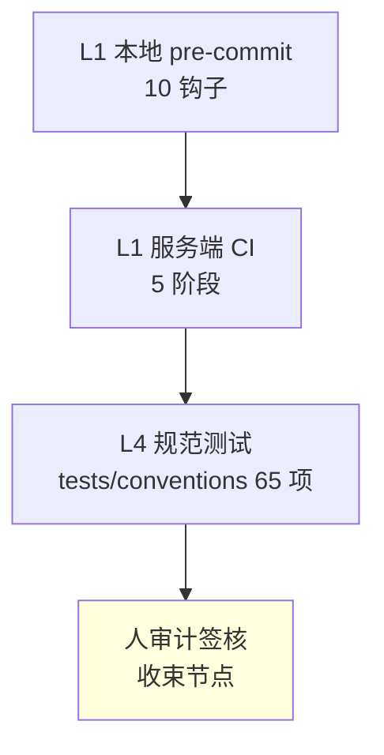

# 审查报告 · 强制性约束

> 版本: v1.0 · 2026-06-10
> 标的: `/root/开发规范`（devguard，自称 V1.2，STATUS 实为 V2.0.1）
> 范围: 重点审查「强制性约束（红线 + 核心原则）」及其执行与自身守约情况

---

## 一、背景与目标

devguard 是一套「可复制到新项目」的通用开发规范，自身也用 Git + 10 钩子 + 5 阶段 CI 管理，并宣称做过 dogfood（V2.0.1 用自身规范约束自身代码）。

本次审查目标：盘点其**强制性约束**，并核查这套约束**自身是否被遵守**（dogfood 的真实成色）。

---

## 二、强制性约束全量盘点

### 2.1 六维度红线（违反 = 打回）

| 维度 | 强制红线 | 自动检测层 |
|------|---------|-----------|
| 01 架构 | 禁循环依赖 · 领域层不依赖框架 · 禁跨层调用 | import-linter |
| 02 代码 | 禁 print · SQL 参数化 · 密钥走环境变量 · 禁 `except:pass` · 禁注释代码/断点 · 日志脱敏 · 输入校验 | ruff + gitleaks |
| 03 Git | **main 禁直推** · Conventional Commits · 一 commit 一事 · 禁 force push · ≥1 Approve | commitlint + 分支保护 |
| 04 API | 名词复数+kebab · 统一响应 · 错误码唯一 · 默认认证 · 向后兼容 | spectral |
| 05 测试 | 独立不依赖顺序 · 只 Mock 外部边界 · 覆盖正常+边界+异常 · 无 flaky | 覆盖率门禁 |
| 06 文档 | 必有 README · **发布更 CHANGELOG** · 文档随码同步 · 公共 API docstring · 注释与代码一致 | 审查 |

### 2.2 流程级强制（收束节点）

- 收束节点是**强制流程**：跳过 = 后续功能点不通过
- 闸门拦截：到点未收束，**AI 拒绝开始下一功能点**
- AI 审计须 0 红线；**人审计必须执行，且在 AI 之后**
- 收束产物必须落盘 `docs/reports/`

### 2.3 五条核心原则

不越界 / 不黑盒 / 不断档 / 不拖欠 / **不积压**（到收束节点必收束）。

---

## 三、约束执行架构（四层防御）

> 评价：前三层「机器可强制」，第四层「人审计」靠自觉——这正是规范自己点名的「强制却仅靠自觉」的矛盾点。

---

## 四、审查发现（6 项）

| # | 发现 | 违反约束 | 证据 | 严重度 |
|---|------|---------|------|:---:|
| F1 | 14 个收束节点中 13 个人审计 `⏳ 待签核`，仅 v0.1 有签核文件 | 06-收束「人审计必做，且在 AI 之后」「强制流程」 | `STATUS.md` 收束历史表；仅 `人审计签核-v0.1.md` 存在 | 🔴 高 |
| F2 | 文档三方数据漂移 | 06「文档随码同步」；CLAUDE 单一事实源 | README=V1.2/15规范/35；STATUS=V2.0.1/17规范/49；CLAUDE=35/35 且写「尚无收束执行记录」（与 14 节点矛盾） | 🟠 中 |
| F2+ | CHANGELOG 停在 V1.4，漏 V1.5/V2.0.1 | 06 红线「发布更 CHANGELOG」 | `CHANGELOG.md` 最新 `## [V1.4]`，STATUS 已记 V1.5/V2.0.1 完成 | 🟠 中 |
| F3 | 工作树 16 个 research 文件改动长期未提交 | 核心原则「不积压」；03「一 commit 一事」 | `git status -s` 16×M；`git diff --ignore-all-space` 为空 → 纯 CRLF 噪音 | 🟠 中 |
| F4 | 直接在 `master` 提交，无 PR/合并记录 | 03 红线 1「main 禁直推」 | `git branch`=master；`git log` 全直接 commit | 🟡 低（单人，档位可豁免，但红线文案为绝对） |
| F5 | 调研目录 N1–N6 各存两个近重名文件 | FILE_GRAPH 单一权威 / 08 去重 | `tree/` 下 N1「构建方法」vs「的构建方法」等 6 对 | 🟡 低（经查实为两套不同主题树，非字节重复） |

> 不可达项：本机环境无 `pytest` 模块，「65 L4 tests passed」未能独立复跑（仅静态核对计数：v0.1 签核记 53，STATUS 现记 65，演进合理）。

---

## 五、结论

| 维度 | 结论 |
|------|------|
| 约束设计 | ✅ 标杆级——红线分层、配自动检测、去重映射清晰、3 处导航表口径一致 |
| 可执行性 | ✅ 四层防御落地完整，配置复制即用 |
| 自身 dogfood 守约 | ⚠️ 部分——机器可强制的红线守住了，靠人自觉的红线（人审计、文档同步、工作树整洁）原本欠账 |
| 一句话 | 这套规范「教得对、做得差一口气」——凡机器能卡的都守住，凡需人收尾的都欠着，而这恰是它自己点名的最难处 |
