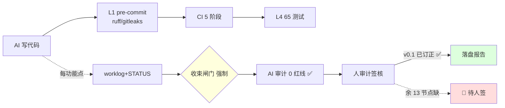

# 简报 · 强制性约束审查与修复

> 版本: v1.0 · 2026-06-10
> 3 秒读懂：devguard 的强制约束**设计满分、执行四层**；漏的全在「人收尾」——本轮修掉 4 项机器可改项，留账 3 项需人定夺。
> 更新: 2026-06-10

---

## 发现与处置速览

| 发现 | 严重度 | 处置 | 状态 |
|------|:---:|------|:---:|
| F3 工作树 16 文件脏 | 🟠 | 证实纯 CRLF 噪音，checkout 还原 | ✅ |
| F2 README/CLAUDE/STATUS 三方数据漂移 | 🟠 | 锚定 _meta.yaml+STATUS 统一口径 | ✅ |
| F2+ CHANGELOG 落后至 V1.4 | 🟠 | 回填 V1.5 + V2.0.1 | ✅ |
| F1 STATUS v0.1 人审计漏标 ⏳ | 🔴 | 实已签核 → 改 ✅ | ✅ |
| F1 余 13 节点人审计未签 | 🔴 | AI 不伪造签字，留账 | 待人 |
| F4 master 直推（违 03 红线1） | 🟡 | 不改 git 历史，留账 | 待人 |
| F5 N1–N6 两套研究树共存 | 🟡 | 非字节重复，删则丢内容 | 待人 |

---

## 关键数字

| 指标 | 修复前 → 修复后 |
|------|------|
| 版本口径 | V1.2/35/V2.0.1 三方打架 → **统一 V2.0.1** |
| 规范计数 | 15/16/17 不一 → **统一 17（=_meta.yaml）** |
| 功能点 | 35（陈旧） → **49** |
| CHANGELOG 最新 | V1.4 → **V2.0.1** |
| 工作树脏文件 | 16 → **0** |
| 改动文件（未提交） | — → **4** |

---

## 约束执行拓扑（修复后）

---

## 核心结论

| 维度 | 结论 |
|------|------|
| 约束设计 | ✅ 标杆——红线分层、配检测、去重映射清晰、3 表口径一致 |
| 可执行性 | ✅ 四层防御落地完整，配置复制即用 |
| 自身守约 | ⚠️ 机器可强制的红线守住了，靠人自觉的（人审计/文档同步/工作树）原本欠账 |
| 最该先补 | 🔴 v0.2–v1.5 共 13 份人审计签字——只能由人闭合 |
