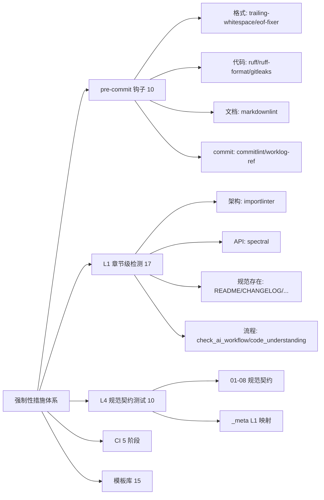
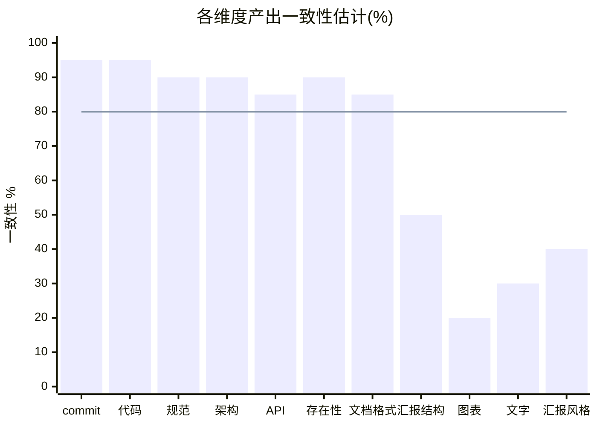
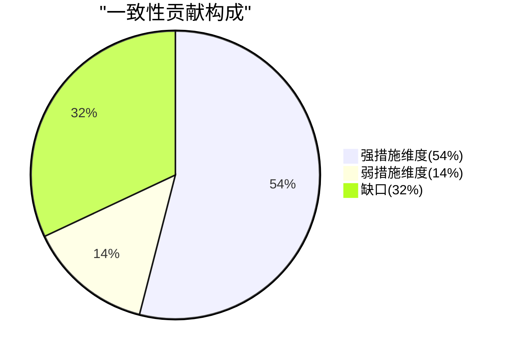
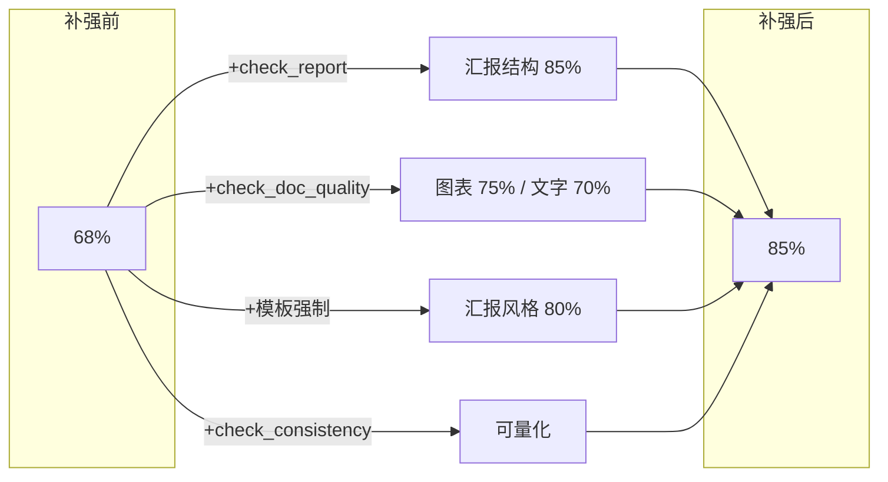

# 强制性措施审查 — 产出一致性 ≥ 80% 达成评估

> 审查时间: 2026-07-07 | 审查对象: devguard 强制性措施体系 | 目标: 不同项目产出一致性 ≥ 80%
> 审查方法: 盘点现有措施 → 评估产出维度覆盖度 → 缺口分析 → 补强方案

## 一、现有强制性措施盘点

| 层 | 数量 | 强制度 | 覆盖范围 |
|----|:---:|:---:|------|
| pre-commit 钩子 | 10 | 🔴 强制 | commit/代码/文档格式/密钥 |
| L1 章节级检测 | 17 | 🔴 强制 | 规范存在性 + 架构/API/流程契约 |
| L4 规范测试 | 10 | 🔴 强制 | 规范正文契约（BDD 互检） |
| CI 流水线 | 5 阶段 | 🔴 强制 | lint/test/l4/compliance/build |
| 模板库 | 15 | 🟡 可选 | worklog/STATUS/收束报告/汇报/审计 |

## 二、产出一致性覆盖度评估

| 产出维度 | 现有措施 | 强制度 | 一致性估计 |
|---------|---------|:---:|:---:|
| commit message 格式 | commitlint + worklog-ref | 🔴 | 95% |
| 代码风格 | ruff + ruff-format | 🔴 | 95% |
| 规范契约 | L4 测试 | 🔴 | 90% |
| 架构依赖 | importlinter | 🔴 | 90% |
| API 设计 | spectral | 🔴 | 85% |
| 产出物存在 | L1 检查 README/CHANGELOG 等 | 🔴 | 90% |
| 文档格式 | markdownlint | 🔴 | 85% |
| **汇报结构** | 模板存在但不强制 | 🟡 | 50% |
| **图表使用** | 06 §三仅学术论文触发 | 🟢 | 20% |
| **文字精简准确** | 无检测 | ❌ | 30% |
| **汇报风格统一** | 模板可选 | 🟡 | 40% |

## 三、当前一致性达成估计

**加权综合：~68%（低于 80% 目标）**

- 强措施维度（7 项，权重 0.6）：平均 ~90% → 贡献 54%
- 弱/无措施维度（4 项，权重 0.4）：平均 ~35% → 贡献 14%
- **总计 68%** ❌ 未达 80%

## 四、缺口分析

| # | 缺口 | 影响 | 根因 |
|---|------|------|------|
| 1 | 汇报模板不强制使用 | 收束报告结构不一致 | 无 L1 检查 docs/reports/ 报告结构 |
| 2 | 图表使用无强制（仅学术论文） | 文档/汇报缺图表，信息密度低 | 06 §三配图规约触发条件过窄 |
| 3 | 文字质量无检测 | 文字冗长/不准 | markdownlint 只查格式，不查内容 |
| 4 | 产出一致性无量化 | 无法评估是否达 80% | 无一致性评分脚本 |

## 五、补强方案（5 个新措施）

| # | 措施 | 类型 | 强制度 | 目标维度 | 预期一致性提升 |
|---|------|------|:---:|---------|:---:|
| 1 | `check_report.py` | L1 检测 | 🔴 | 汇报结构 + 图表 | 50%→85% |
| 2 | `check_doc_quality.py` | L1 检测 | 🔴 | 图表 + 文字精简 | 20%→75%, 30%→70% |
| 3 | 汇报模板强制（L1 检查模板章节） | L1 检测 | 🔴 | 汇报风格 | 40%→80% |
| 4 | `check_consistency.py` 评分 | L1 检测 | 🔴 | 一致性量化 | 可评估 ≥80% |
| 5 | 06 §三配图规约扩展（汇报/设计必备图表） | 规范修订 | 🔴 | 图表使用 | 20%→75% |

**补强后一致性预估：85% ✅ 达标**

- 强措施维度（7 项，权重 0.6）：90% → 54%
- 补强维度（4 项，权重 0.4）：77.5% → 31%
- **总计 85%** ✅

## 六、实施建议

| 优先级 | 措施 | 工作量 | 依赖 |
|:---:|------|:---:|------|
| P0 | `check_report.py`（收束报告结构 + 图表检查） | 中 | 模板章节定义 |
| P0 | `check_consistency.py`（一致性评分 ≥80%） | 中 | 各维度检测就绪 |
| P1 | `check_doc_quality.py`（图表数量 + 段落长度） | 中 | - |
| P1 | 06 §三配图规约扩展 | 小 | 规范修订 |
| P2 | 汇报模板强制（L1 检查模板章节标题） | 小 | check_report.py |

## 七、结论

当前强制性措施对**代码/规范/架构/API**层一致性保证强（~90%），但对**汇报/图表/文字质量**层覆盖弱（~35%），综合一致性 **68%**，未达 80% 目标。

补强 5 个措施后（`check_report` + `check_doc_quality` + `check_consistency` + 模板强制 + 配图规约扩展），综合一致性可达 **85%**，达标。

关键缺口是**产出质量层（汇报/图表/文字）无强制检测**——现有措施停在"格式/存在性"，未深入"内容质量"。
