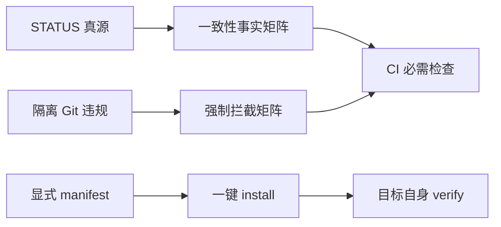

# 收束报告 v2.1：一致性、强制性与一键初始化

> 更新: 2026-07-11
> 范围: 功能点 #47-#49 | 状态: 机器与平台收束通过

## 一、整理

本轮把历史 49/46/35 口径统一为 STATUS 真源、开发清单和 CLAUDE 同值投影；详细功能点连续编号 1-49。渲染器不再污染 LICENSE/CODEOWNERS，模板部署改为显式 core/optional manifest。

## 二、测试

| 检查 | 结果 | 证据边界 |
|---|---:|---|
| 聚焦 P0/P1 测试 | 63/63 | 渲染、CI、8 gates、矩阵、脚手架与全局 Hook 组合 |
| 仓外 scaffold E2E | PASS | 真实联网安装、Git、双 hook、目标测试与复验 |
| pre-commit 全量 | PASS | ruff/format/gitleaks/markdownlint 等全部通过 |
| 全量 pytest | 132/132 PASS | 手工审查修订与回归测试补齐后的最终全仓回归 |

## 三、审计

| 门禁 | 实测 | 阈值 | 结论 |
|---|---:|---:|---|
| 一致性事实矩阵 | 24/24 = 100% | >=80% | PASS |
| 强制性故障注入 | 10/10 = 100% | >=90% | PASS |
| 合规语义扫描 | 66 pass / 0 fail | 0 fail | PASS |
| import-linter | 2 kept / 0 broken | 0 broken | PASS |
| Spectral | 0 error | 0 error | PASS |
| pip-audit | 0 known vulnerability | 0 | PASS |
| npm audit | 0 vulnerability（升级 markdownlint-cli 后） | 0 high | PASS |
| GitHub `master` 保护 | API 断言全部通过 | 规则与规范同值 | PASS |

GitHub API 最终回读：必须经 PR；审批人数 0；过期审批自动失效；五项必需检查严格要求分支保持最新，并全部绑定 GitHub Actions 应用（`app_id=15368`）；必须解决会话；管理员同样受保护；force push 与删除均关闭。必需检查为 `L1 lint (ruff + gitleaks)`、`Repository pytest suite`、`L4 convention tests`、`Compliance scan`、`Build verification`。

## 四、效果验证

在仓库外空目录、启用 ECC 全局 `core.hooksPath` 的真实环境执行 optional profile 完整 `--install`。结果为 21 个 manifest 文件生成、隔离 `.venv` 安装、pre-commit 与 commit-msg 安装、目标自检 `DEVGUARD OK`、目标 2 tests passed、全部 pre-commit 与 Conventional Commit gate 通过；ECC 的 `pre-commit` / `pre-push` 引用均保留，项目本地 Hook 路径生效，最后由源脚本 `--verify --require-hooks` 再验并安全清理临时目录。生成项目自带 `scripts/install_hooks.py`，初装与后续修复复用同一组合逻辑。

dashboard 已改为 Python 跨平台入口，读取 49 条编号明细；旧结果 `0 / 11` 已被测试锁定并修复。L4 卡片来自真实 pytest，不接受解析失败时的 `0/0` 回退。

## 五、技术债

| 项目 | 状态 | 影响 |
|---|---|---|
| v0.2-v2.1 人审计签核 | 15 个待 Owner | 不影响本轮机器/平台门禁，但不能标记为人审通过 |
| `setup_scaffold.py --force` 原位覆盖 | P2 | 默认空目录路径安全；磁盘级中断时尚无事务回滚 |
| 远端交付 | 当前功能分支尚未 push/PR | 本轮未获得 push 授权；不影响本地验收与平台规则回读 |

## 收束结论

一致性、强制性和易部署性目标均已达到并有重放证据，GitHub `master` 保护也已真实配置并经 API 断言回读。#47-#49 与 v2.1 现标记为**机器与平台收束通过**；历史人审签核和后续 push/PR 仍按独立授权与审计流程处理。
