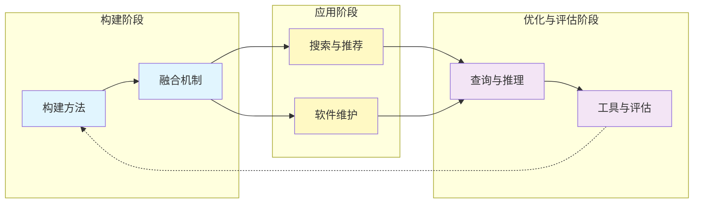

# 知识体系总览

> 更新: 2026-07-11

## 节点索引
- [N1 代码知识图谱构建方法](N1-代码知识图谱构建方法.md)
- [N2 代码理解与知识图谱的融合机制](N2-代码理解与知识图谱的融合机制.md)
- [N3 基于知识图谱的代码搜索与推荐](N3-基于知识图谱的代码搜索与推荐.md)
- [N4 代码知识图谱在软件维护中的应用](N4-代码知识图谱在软件维护中的应用.md)
- [N5 代码知识图谱的查询与推理技术](N5-代码知识图谱的查询与推理技术.md)
- [N6 代码知识图谱的构建工具与评估](N6-代码知识图谱的构建工具与评估.md)

好的，作为知识架构专家，我将根据您提供的节点清单和主线提示，为您构建一个结构化的知识树主表。

---

### 代码知识图谱知识树主表

#### 1. 节点索引（每节点一句话核心问题）

| 节点编号 | 节点名称 | 核心问题 |
| :--- | :--- | :--- |
| **N1** | 代码知识图谱构建方法 | 如何从源代码中提取实体（如函数、类、变量）和关系（如调用、继承、依赖），构建出结构化的代码知识图谱？ |
| **N2** | 代码理解与知识图谱的融合机制 | 知识图谱如何增强代码理解，例如通过语义查询、依赖分析或上下文推理，帮助开发者更快地理解代码逻辑？ |
| **N3** | 基于知识图谱的代码搜索与推荐 | 如何利用知识图谱实现更精准的代码搜索、API推荐或代码复用，超越传统基于文本匹配的方法？ |
| **N4** | 代码知识图谱在软件维护中的应用 | 知识图谱如何辅助软件维护任务，如缺陷定位、变更影响分析或重构建议，从而降低维护成本？ |
| **N5** | 代码知识图谱的查询与推理技术 | 针对代码知识图谱，有哪些高效的查询语言（如SPARQL）、图算法（如社区发现）或推理机制（如规则推理）？ |
| **N6** | 代码知识图谱的构建工具与评估 | 现有代码知识图谱构建工具有哪些？如何评估其质量和覆盖度，以确保图谱的可用性和准确性？ |

#### 2. 主线流程（因果/递进关系）

本知识树遵循 **“构建 -> 理解 -> 应用 -> 优化”** 的递进逻辑。

- **递进关系**：
    1.  **构建是基础**：没有高质量的代码知识图谱（N1），后续所有应用都无从谈起。
    2.  **融合是桥梁**：构建好的图谱需要与代码理解机制（N2）深度融合，才能发挥其语义优势，成为可用的智能工具。
    3.  **应用是目标**：在理解的基础上，图谱的价值体现在具体的应用场景中，如搜索推荐（N3）和软件维护（N4）。
    4.  **查询与推理是核心能力**：无论是搜索还是维护，都需要高效的查询和推理技术（N5）来挖掘图谱中的深层信息。
    5.  **工具与评估是闭环**：最终，我们需要通过工具（N6）来落地这些技术，并评估其效果，反馈到构建阶段（N1），形成持续优化的闭环。

#### 3. 跨节点交叉关联表

此表展示了不同节点之间的关键交叉关系，揭示了知识树内部的复杂网络。

| 关联节点 | 关联类型 | 关联描述 | 典型场景/问题 |
| :--- | :--- | :--- | :--- |
| **N1 ↔ N2** | **输入与赋能** | N1构建的图谱是N2融合机制的直接输入。N2的需求（如需要何种关系）反过来指导N1的构建策略。 | 如何设计实体关系抽取规则（N1），使其能更好地支持基于上下文的代码理解（N2）？ |
| **N2 ↔ N3** | **能力支撑** | N2提供的语义理解和依赖分析能力，是N3实现精准搜索和推荐的核心引擎。 | 利用N2的“函数调用链”推理，在N3中实现“搜索修改某函数会影响的全部代码”的功能。 |
| **N2 ↔ N4** | **能力支撑** | N2提供的代码结构理解和变更影响分析，是N4进行缺陷定位和重构建议的基础。 | 基于N2的“数据流依赖”分析，在N4中定位“变量未初始化”的缺陷源头。 |
| **N3 ↔ N5** | **需求驱动** | N3中的复杂查询（如“查找所有实现了某接口且无副作用的函数”）驱动N5开发更高效的查询语言和推理算法。 | 为满足N3的实时搜索需求，N5需要设计针对代码图谱的图索引和近似查询算法。 |
| **N4 ↔ N5** | **需求驱动** | N4中的任务（如“预测修改类A会对哪些测试用例造成影响”）需要N5提供强大的图遍历和推理能力。 | 在N4中分析变更影响时，N5需要支持“可达性分析”和“影响范围传播”等图算法。 |
| **N5 ↔ N6** | **技术与工具** | N5中提出的查询与推理技术，需要被N6中的工具实现和集成。N6的评估结果可以验证N5技术的有效性。 | 评估一个代码知识图谱工具（N6）时，其内置的查询语言（N5）是否支持SPARQL 1.1标准是一个关键指标。 |
| **N1 ↔ N6** | **构建与评估** | N6中的工具用于执行N1的构建过程。N6的评估指标（如准确率、召回率、覆盖度）直接衡量N1构建方法的好坏。 | 使用工具A（N6）构建图谱，并通过评估其“实体识别准确率”（N6）来判断N1中使用的静态分析技术是否有效。 |
| **N3 ↔ N4** | **协同应用** | 在大型软件维护中，N3的搜索推荐功能可以辅助N4的维护任务。例如，通过搜索找到所有相关代码片段，再进行重构。 | 在重构一个API时，先用N3搜索出所有调用该API的代码，再用N4分析这些调用的影响，最后给出重构建议。 |
